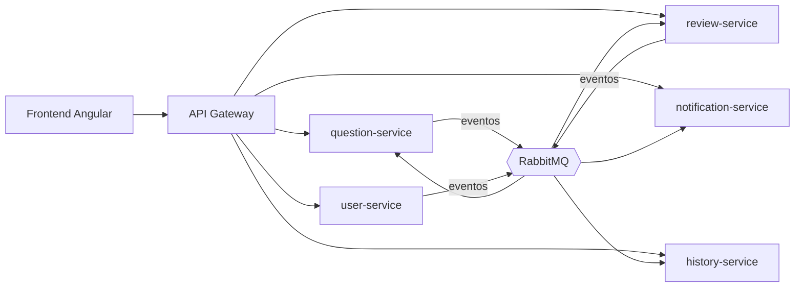

# Banco de Preguntas Saber Pro

Sistema para la **gestión, validación y administración de un banco de preguntas** para la preparación de las pruebas
Saber Pro. Proyecto de curso de Ingeniería de Software II, Universidad del Cauca, periodo 2026.2.

Los autores redactan preguntas de selección múltiple que el sistema valida estructuralmente; un administrador asigna
de 1 a 3 revisores; los revisores evalúan y la pregunta se aprueba por unanimidad; el administrador publica las
aprobadas. Cada paso genera notificaciones y queda en un historial.

## Tecnología

| Parte | Tecnologías |
|---|---|
| Backend | Java 21, Spring Boot 3, Spring Data JPA, Flyway, PostgreSQL, RabbitMQ |
| Seguridad | Keycloak (OAuth2, JWT), previsto para el corte 3 |
| Frontend | Angular, TypeScript |
| Infraestructura | Docker y Docker Compose |
| Calidad | JUnit 5, MockMvc, ArchUnit, PostgreSQL embebido en las pruebas |
| Monolito del primer corte | Java 17, Swing, SQLite |

## Arquitectura

Microservicios orientados a eventos: cada servicio tiene su propia base de datos y se comunican por RabbitMQ a
través de un API Gateway. Los servicios se publican por partes; hoy está disponible `question-service`.



El diseño completo está en la [documentación del segundo corte](docs/corte-2/README.md).

## Estructura del repositorio

```
├── docs/             Documentación: general, corte-1, corte-2 y corte-3
├── monolito/         Corte 1: aplicación de escritorio (app y modulos)
└── microservicios/   Cortes 2 y 3: plataforma y servicios
```

## Cómo ejecutarlo

**Servicio de preguntas y su infraestructura**, con Docker Desktop:

```bash
cd microservicios
docker compose up -d --build
```

El servicio queda en http://localhost:8082/swagger-ui.html. Más detalles en el
[README de microservicios](microservicios/README.md).

**Monolito de escritorio (primer corte)**, con Java 17 y Maven:

```bash
cd monolito
mvn package
java -jar app/target/banco-preguntas-saberpro.jar
```

Más detalles en el [README del monolito](monolito/README.md).

## Documentación

| Documento | Contenido |
|---|---|
| [`docs/general`](docs/general/README.md) | Visión general, flujo de trabajo, convenciones, respuestas de los docentes y enunciados |
| [`docs/corte-1`](docs/corte-1/README.md) | Monolito: historias de usuario, C4, patrones, pruebas |
| [`docs/corte-2`](docs/corte-2/README.md) | Microservicios: contextos y eventos, arquitectura, patrones, prototipos y contratos de la API |
| [`docs/corte-3`](docs/corte-3/README.md) | Alcance del tercer corte |

Para colaborar, ver [CONTRIBUTING.md](CONTRIBUTING.md).

## Estado

| Corte | Estado |
|---|---|
| 1. Monolito | Entregado |
| 2. Microservicios | En publicación por partes |
| 3. Hexagonal con DDD, Keycloak, documento final | Pendiente |

## Autores

- Edward Esteban Dávila Salazar: edwarddavila@unicauca.edu.co
- Laura Isabel Sánchez Fernández
- Kevin Yesid Castaño Herrera
