# Prototipos de la interfaz y evaluación de usabilidad

## 1. Prototipos de la interfaz de usuario

Los prototipos están en Figma, en el archivo
[Taller 4 - Mockup Banco de Preguntas](https://www.figma.com/design/kk6g0a8B4gv7wqCsYRb4Xd/Taller-4---Mockup-Banco-de-Preguntas).

| Prototipo (marco de Figma) | Página del archivo | Historia de usuario |
|---|---|---|
| Autor de Preguntas - Formulario | Page 1 | Base de HU-01 y HU-02 |
| Buscar Preguntas - Filtros | Page 1 | Base de HU-03 |
| Revisor - Revisar Pregunta | Page 1 | Flujo posterior a HU-04 |
| Login - Inicio de Sesion, Registro - Registro de Usuario, Tablero generico | Page 1 | Acceso al sistema |
| Vista de Estadisticas, Vista Grafica | Page 1 | Reporte del Administrador (Observer) |
| HU-01 · Crear pregunta (formulario completo) | Primer corte - Prototipos HU-01 a HU-04 | HU-01 (criterio 1) |
| HU-01 · Validación estructural: campos en rojo (criterios 2 y 3) | Primer corte - Prototipos HU-01 a HU-04 | HU-01 (criterios 2 y 3) |

## 2. Pantallas implementadas

Capturas de la aplicación en ejecución (usuario `autor1`).

### HU-01 · Crear pregunta

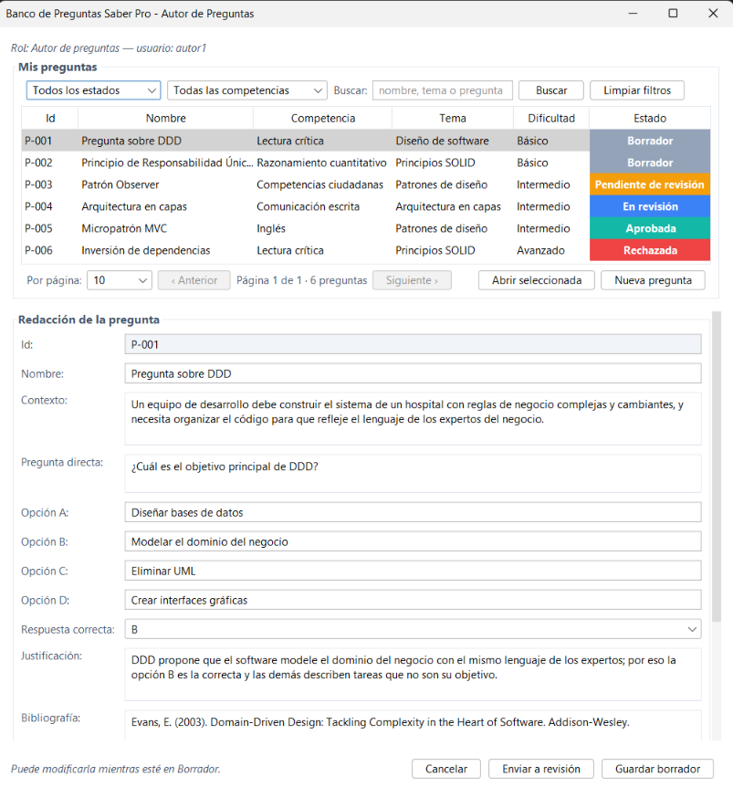

*Figura 1. Formulario con todos los campos de la pregunta (criterio 1).*

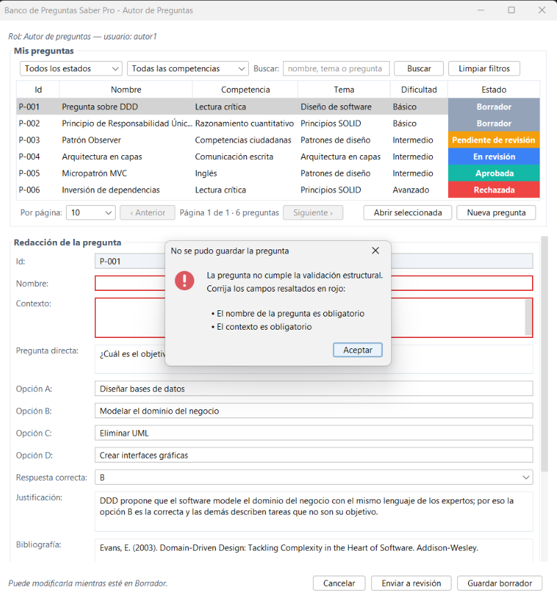

*Figura 2. Al guardar una pregunta que incumple una regla, no se guarda y se explica qué corregir (criterio 3).*

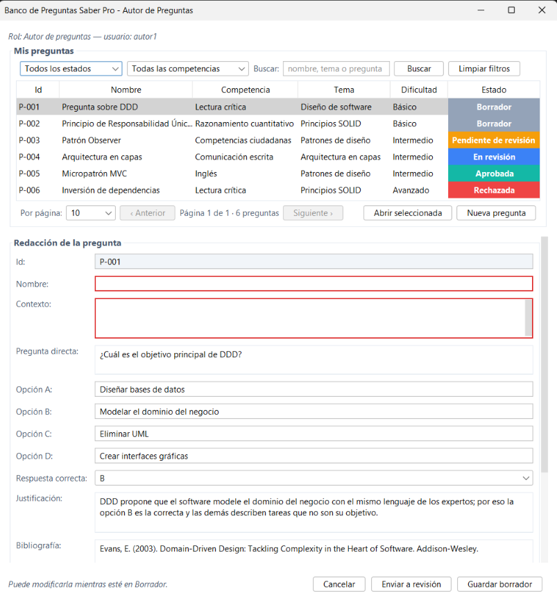

*Figura 3. Los campos que incumplen quedan resaltados en rojo (criterio 2).*

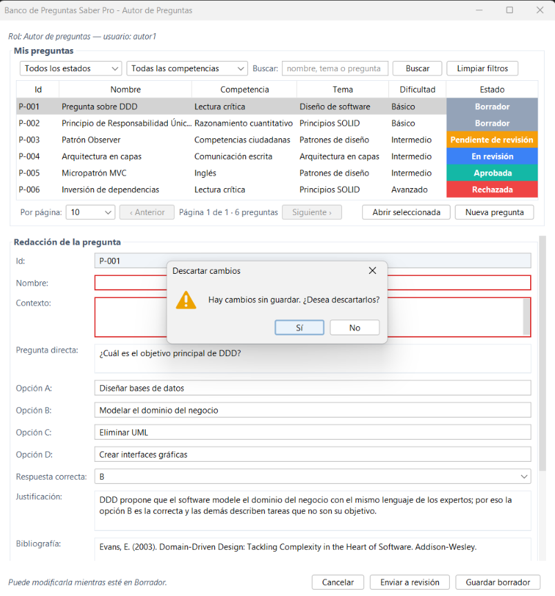

*Figura 4. Cancelar con cambios sin guardar pide confirmación (criterio 4).*

### HU-02 · Enviar a revisión

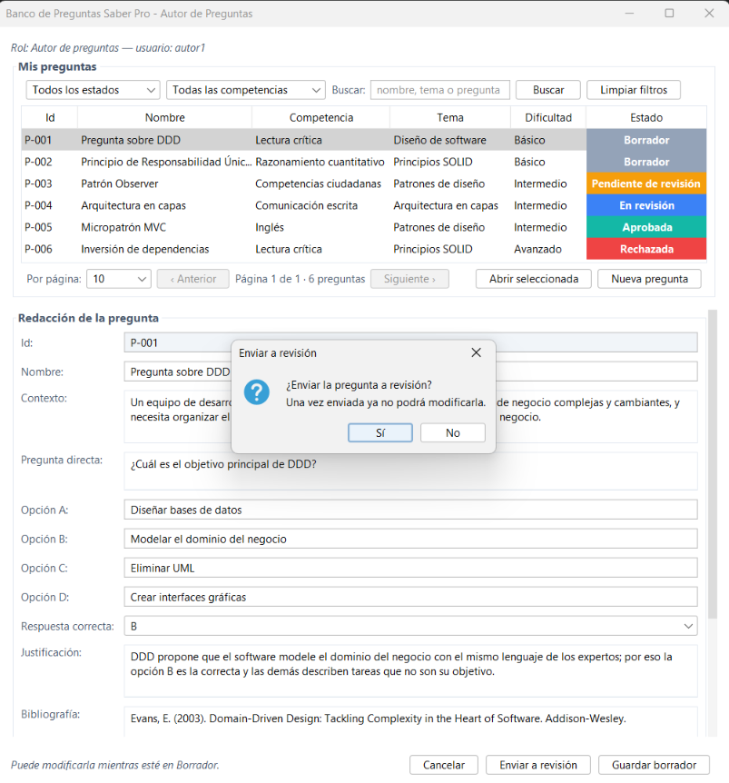

*Figura 5. Antes de cambiar el estado aparece un diálogo de confirmación (criterio 3); si se elige "No", la pregunta sigue en Borrador (criterio 4).*

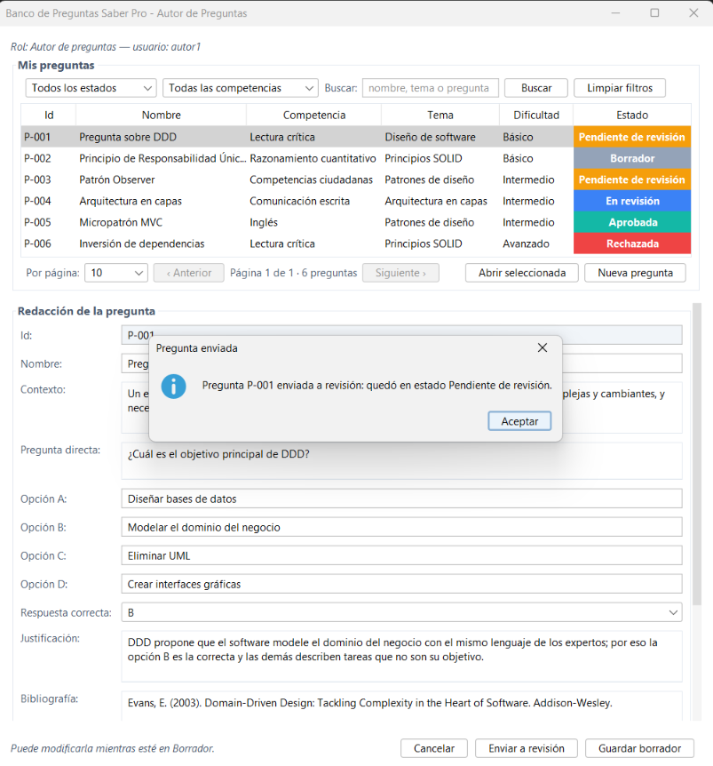

*Figura 6. Confirmación de que la pregunta quedó "Pendiente de revisión".*

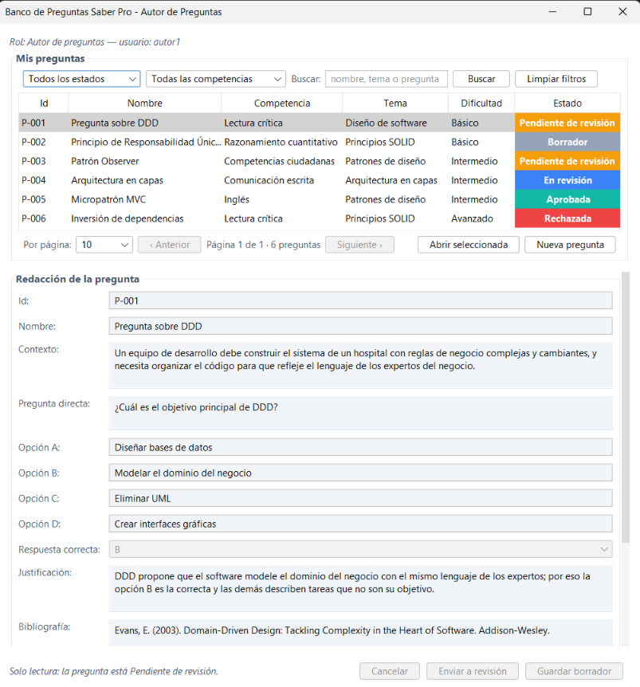

*Figura 7. La pregunta aparece en amarillo en el listado y el formulario queda de solo lectura (criterio 1).*

### HU-03 · Mis preguntas

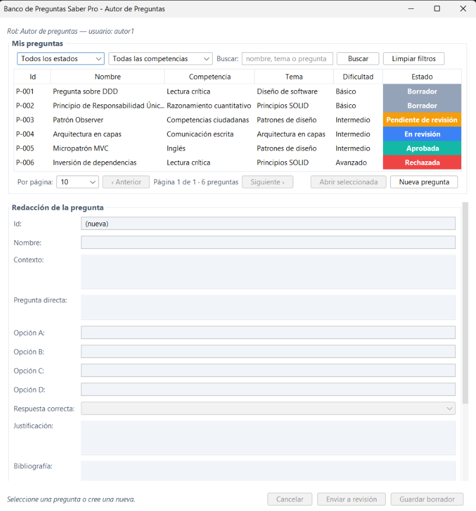

*Figura 8. Tabla paginada de a 10, con el estado de cada pregunta en color (criterio 1).*

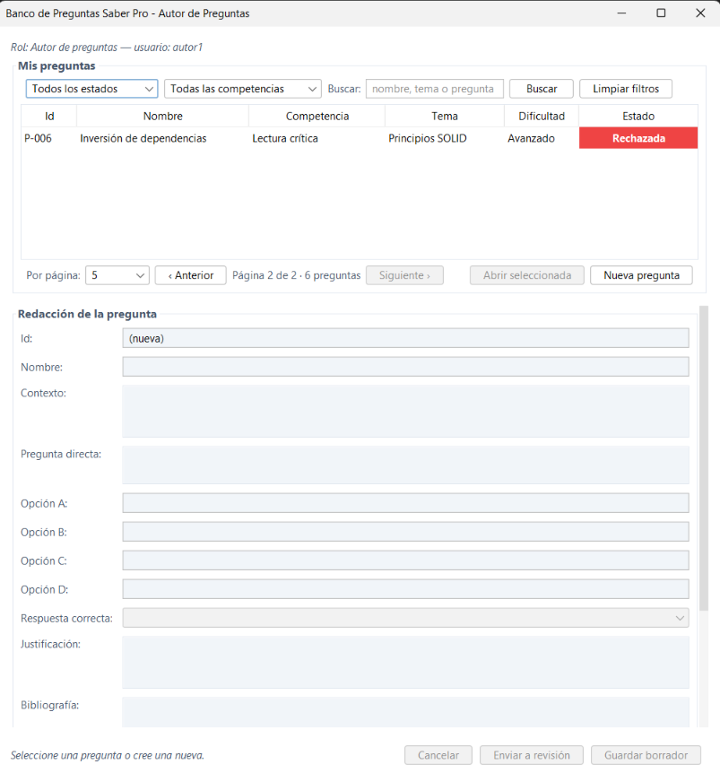

*Figura 9. También se puede ver de a 5 o de a 20; aquí, la página 2 de 2.*

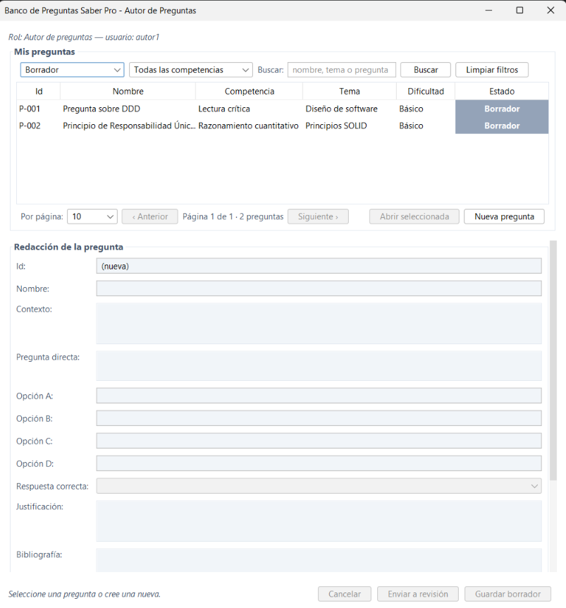

*Figura 10. Filtro por estado "Borrador" (criterio 2).*

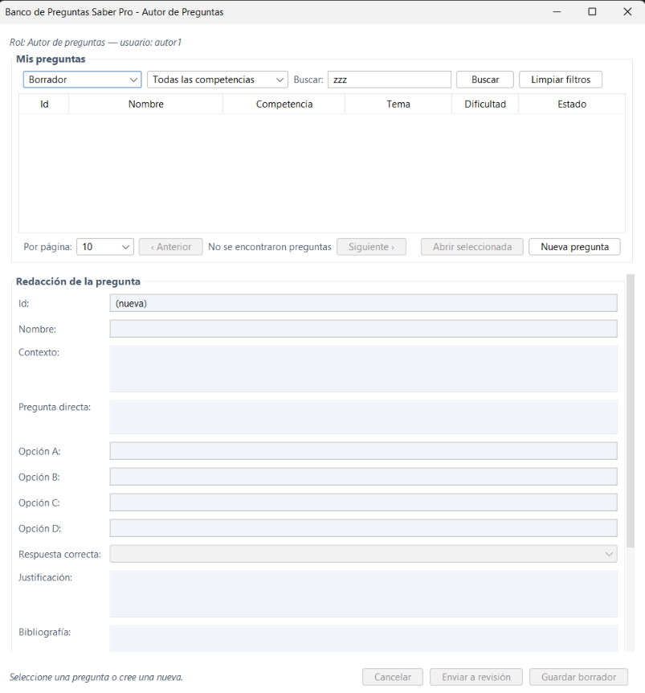

*Figura 11. Sin coincidencias: mensaje "No se encontraron preguntas" y botón "Limpiar filtros" (criterio 3).*

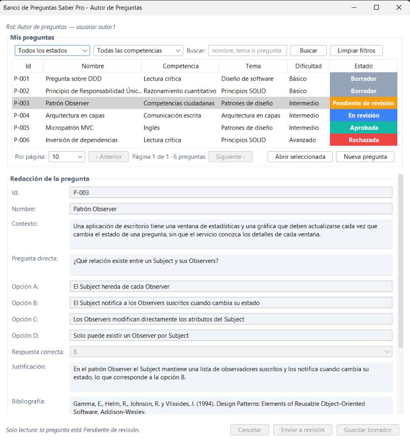

*Figura 12. Una pregunta que no está en Borrador se abre de solo lectura (criterio 4).*

## 3. Evaluación de usabilidad

Se aplican dos técnicas complementarias: una **evaluación heurística** hecha por el
equipo sobre la aplicación de esta iteración, y un **test de usabilidad con usuarios**
con tareas y cuestionario SUS.

### 3.1 Evaluación heurística (heurísticas de Nielsen)

Severidad: 0 = no es un problema, 1 = cosmético, 2 = menor, 3 = mayor, 4 = catastrófico.

**Lo que cumple**

| Heurística | Evidencia en la aplicación |
|---|---|
| 1. Visibilidad del estado del sistema | El aviso al pie del formulario ("Puede modificarla mientras esté en Borrador" / "Solo lectura: la pregunta está Pendiente de revisión"), el estado en color y "Página 1 de 1 · 6 preguntas". |
| 3. Control y libertad del usuario | Cancelar con confirmación (Figura 4), "Limpiar filtros", diálogo de confirmación antes de enviar a revisión (Figura 5). |
| 4. Consistencia y estándares | Los mismos colores de estado en el listado, la ventana del Revisor y las vistas de estadísticas; misma apariencia en todas las ventanas. |
| 5. Prevención de errores | Solo se edita en Borrador; los botones se deshabilitan según el estado; competencia, dificultad y respuesta se eligen de una lista. |
| 9. Ayudar a reconocer y corregir errores | Un mensaje por cada regla incumplida y los campos afectados en rojo (Figuras 2 y 3). |

**Problemas encontrados y mejoras propuestas**

| # | Problema | Heurística | Severidad | Mejora propuesta |
|---|---|---|---|---|
| P1 | El nombre largo de una pregunta se corta en la tabla ("Principio de Responsabilidad Únic…") | 6. Reconocer antes que recordar | 1 | Ensanchar la columna o mostrar el nombre completo al pasar el cursor |
| P2 | Los campos del formulario no indican cuáles son obligatorios hasta guardar | 5. Prevención de errores | 2 | Marcar los campos obligatorios con un asterisco |
| P3 | El botón "Cancelar" descarta los cambios, pero su rótulo no lo dice | 2. Relación con el mundo real | 1 | Renombrarlo "Descartar cambios" |
| P4 | Con un filtro aplicado no hay un indicador de que la lista está filtrada, más allá de los controles | 1. Visibilidad del estado | 2 | Mostrar "Filtros activos" junto al total de preguntas |
| P5 | La ventana del Autor es alta (940 px) y en pantallas pequeñas obliga a desplazarse | 8. Diseño minimalista | 2 | Reducir el alto o dividir el formulario en pestañas |

### 3.2 Test de usabilidad con usuarios

**Objetivo.** Comprobar que un autor de preguntas puede crear, enviar a revisión y
encontrar sus preguntas sin ayuda, y que un administrador puede asignar revisores.

**Participantes.** De 3 a 5 personas con el perfil del sistema: docentes o estudiantes
de últimos semestres que no participaron en el desarrollo.

**Preparación.** Ejecutar la aplicación (`java -jar app/target/banco-preguntas-saberpro.jar`).
Usuarios de prueba (contraseña `Saber2026!`): `autor1` (Autor), `admin1` (Administrador).
La persona evaluadora no explica cómo se usa el sistema: solo lee la tarea y observa.

**Tareas**

| Tarea | Enunciado que se le lee al participante | Éxito si… |
|---|---|---|
| T1 | "Ingrese como `autor1` y redacte una pregunta nueva sobre un tema que usted elija." | Guarda un borrador sin ayuda |
| T2 | "Envíe esa pregunta a revisión." | La pregunta queda "Pendiente de revisión" |
| T3 | "Encuentre todas sus preguntas que estén en Borrador." | Usa el filtro por estado |
| T4 | "Abra una pregunta ya enviada y diga si puede modificarla." | Reconoce que es de solo lectura |
| T5 | "Ingrese como `admin1` y asigne un revisor a una pregunta pendiente." | Asigna al menos un revisor |

**Métricas por tarea:** completó sin ayuda (sí/no), tiempo en segundos, número de
errores y comentarios.

**Cuestionario SUS** (escala de 1 = totalmente en desacuerdo a 5 = totalmente de acuerdo):

1. Creo que me gustaría usar este sistema con frecuencia.
2. Encontré el sistema innecesariamente complejo.
3. Pensé que el sistema era fácil de usar.
4. Creo que necesitaría el apoyo de una persona técnica para usarlo.
5. Encontré que las funciones estaban bien integradas.
6. Pensé que había demasiada inconsistencia en el sistema.
7. Imagino que la mayoría de las personas aprendería a usarlo muy rápido.
8. Encontré el sistema muy incómodo de usar.
9. Me sentí muy seguro/a usando el sistema.
10. Necesité aprender muchas cosas antes de poder usarlo.

**Cálculo del puntaje SUS.** Para las preguntas impares se resta 1 a la respuesta; para
las pares se resta la respuesta de 5. Se suman los diez valores y se multiplican por
2,5: el resultado va de 0 a 100 (68 se considera el promedio; por encima de 80, muy bueno).

**Resultados** (se completan al aplicar el test)

| Participante | T1 | T2 | T3 | T4 | T5 | Puntaje SUS | Observaciones |
|---|---|---|---|---|---|---|---|
| P1 | | | | | | | |
| P2 | | | | | | | |
| P3 | | | | | | | |
| **Promedio / % de éxito** | | | | | | | |

**Cómo se usan los resultados.** Los problemas que aparezcan en dos o más
participantes se agregan a la tabla de problemas de la evaluación heurística con su severidad y se priorizan
para la siguiente iteración.
