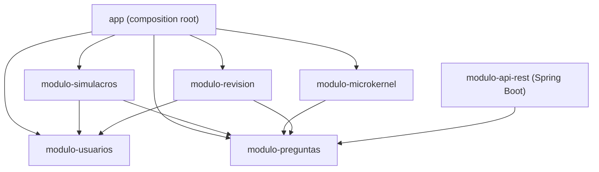
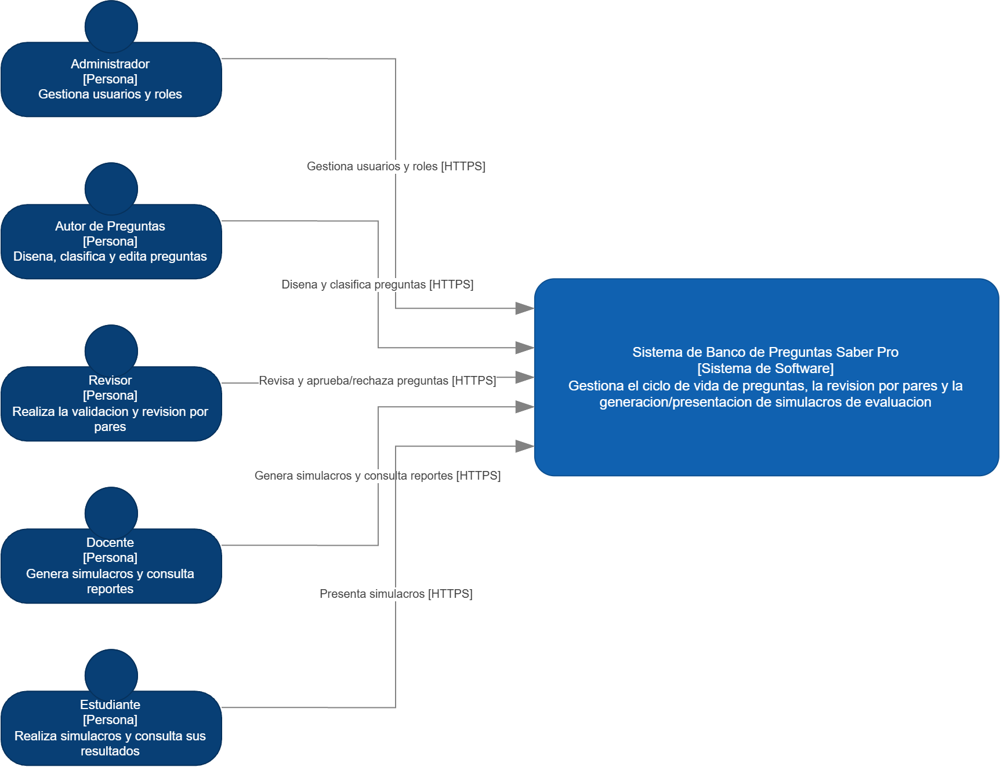
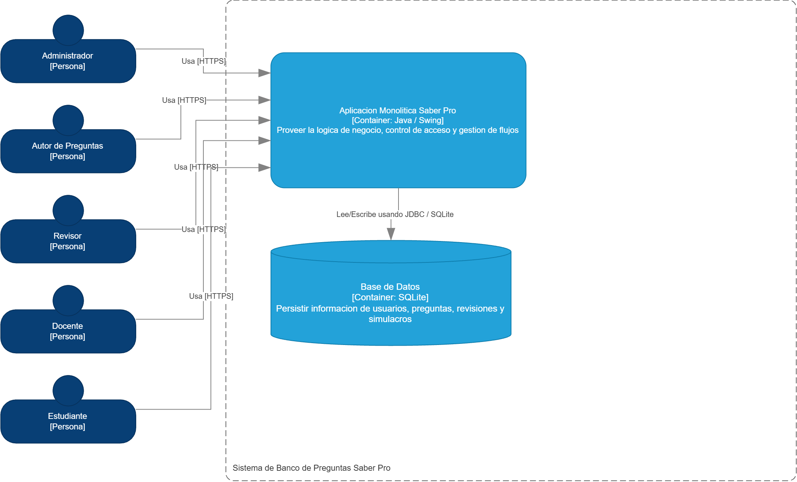
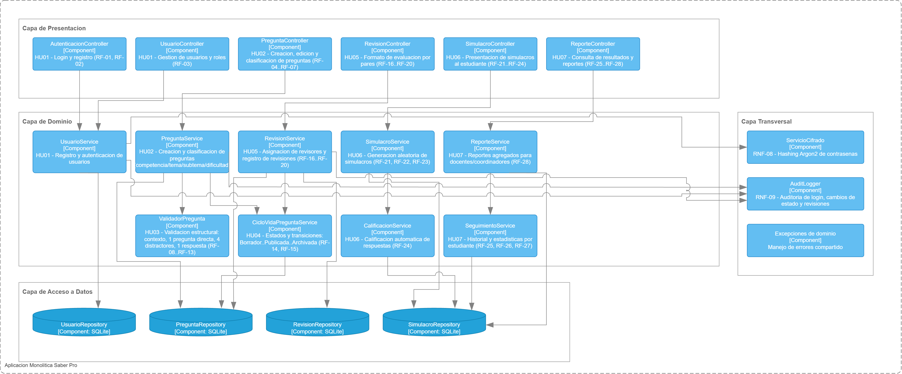
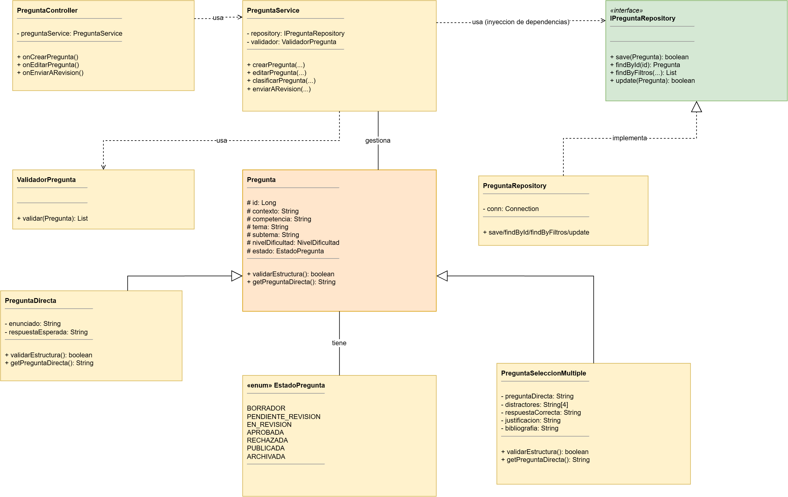
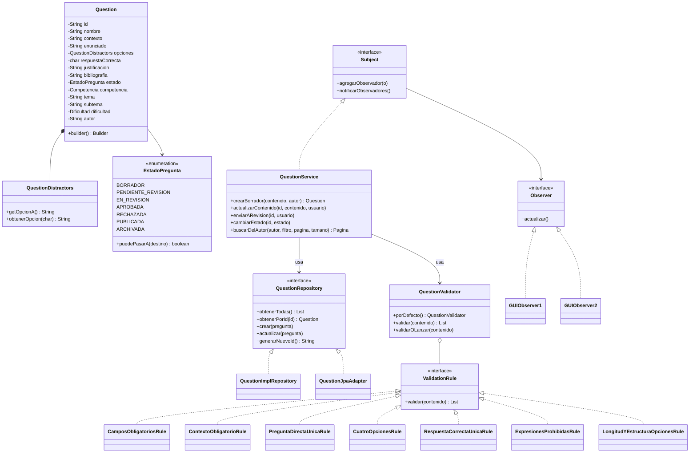
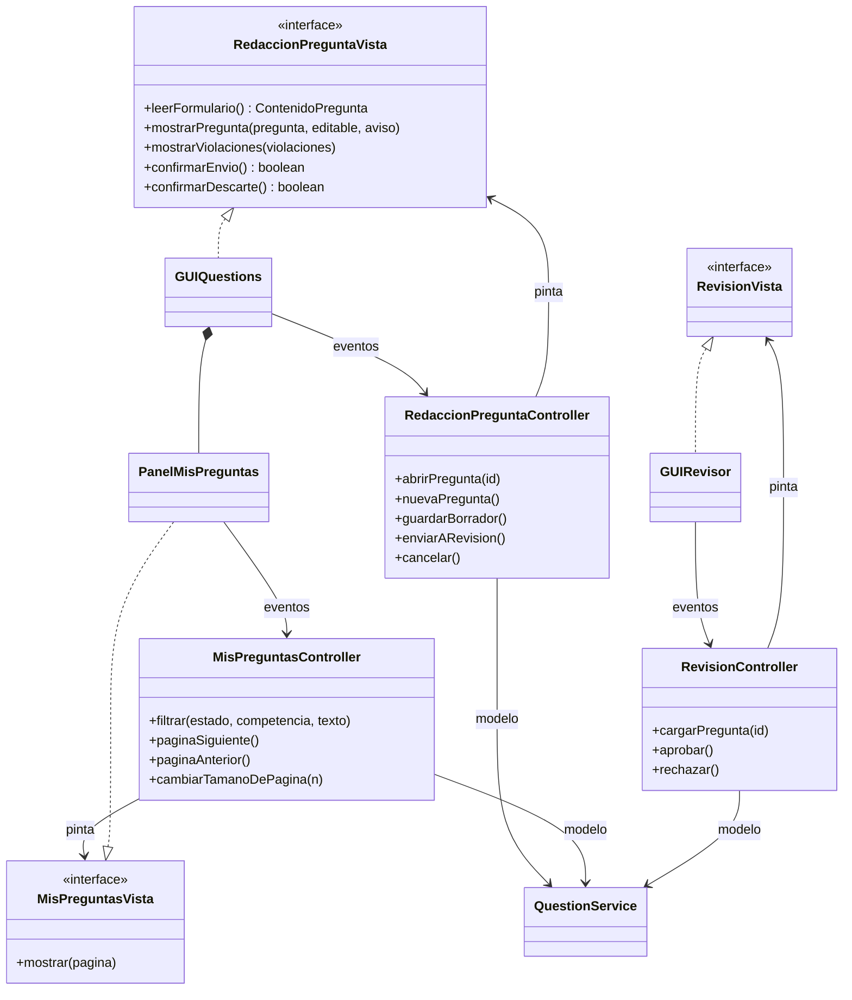
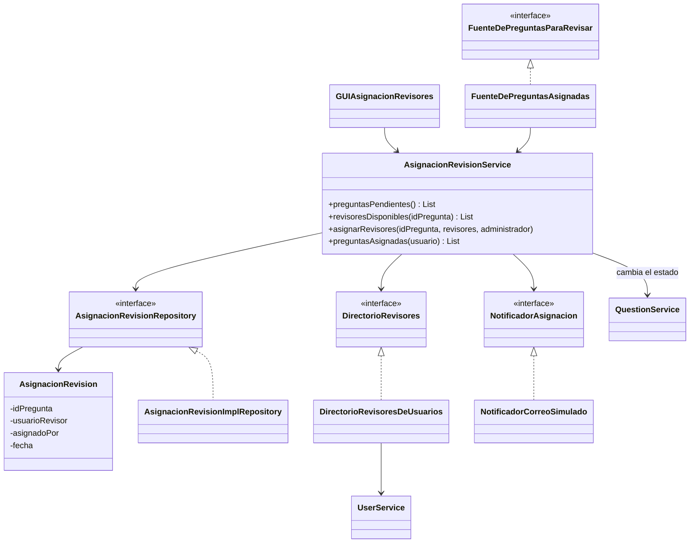
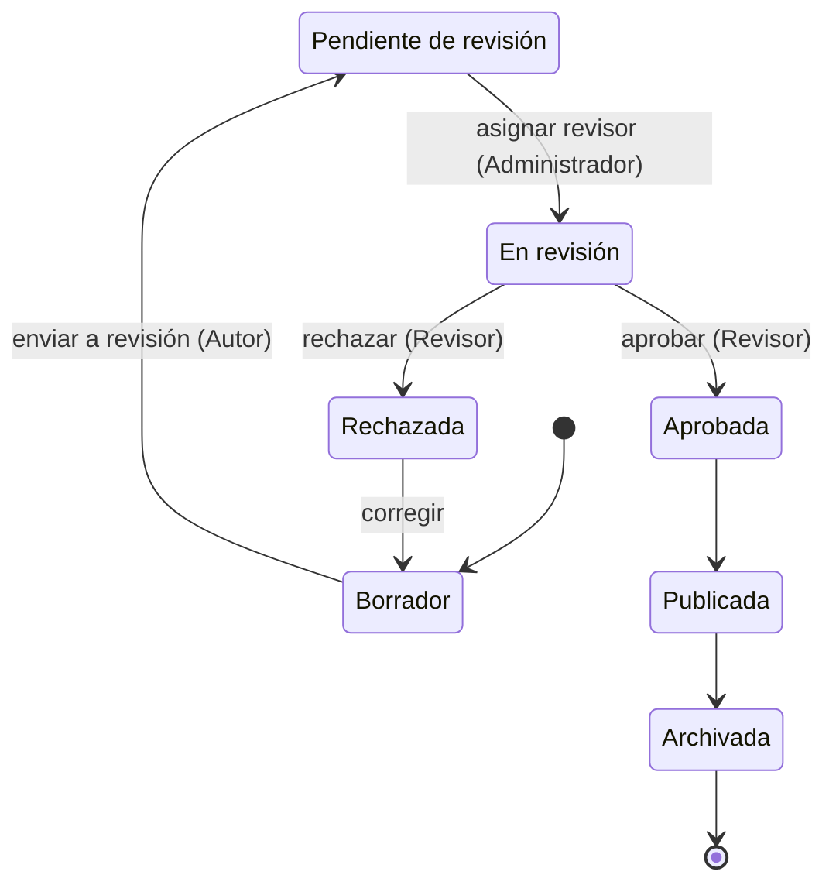
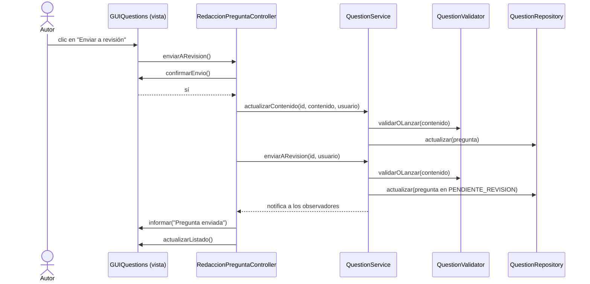

# Arquitectura y diseño de software (modelo C4 y UML)

## 1. Estilo arquitectónico

La aplicación es una **aplicación de escritorio en Java (Swing)** con una
**arquitectura monolítica en tres capas**, organizada como un **monolito modular**
(módulos Maven que se empaquetan en un solo `.jar`) y con el micropatrón **MVC** en
las ventanas. La docente pidió el monolito modular porque el proyecto migrará a
microservicios: si cada módulo ya tiene límites explícitos, más adelante solo hay
que cambiar las llamadas entre módulos por llamadas de red.

Las tres capas de cada módulo:

| Capa | Paquete | Responsabilidad |
|---|---|---|
| Presentación | `presentation` (`ui` en `modulo-usuarios`) | Ventanas Swing (vistas) y controladores MVC |
| Dominio (lógica de negocio) | `domain` | Entidades, reglas, servicios e interfaces (puertos) de los repositorios |
| Acceso a datos | `access` | Implementaciones de los repositorios (memoria o SQLite) |

Las capas se comunican en un solo sentido: presentación → dominio ← acceso a datos.
El dominio define las interfaces y el acceso a datos las implementa (inversión de
dependencias), de modo que el dominio no conoce ni Swing ni la base de datos.

### Módulos y dependencias

| Módulo | Contenido | Historias |
|---|---|---|
| `modulo-usuarios` | Login, registro, roles, cifrado de contraseñas (Argon2id), SQLite | Acceso al sistema |
| `modulo-preguntas` | Pregunta, validación estructural, ciclo de vida, listado, ventanas del Autor y del Revisor | HU-01, HU-02, HU-03 |
| `modulo-revision` | Asignación de revisores y correo simulado | HU-04 |
| `modulo-simulacros` | Generación y presentación de simulacros | Fuera del primer corte |
| `modulo-microkernel` | Generación de preguntas por plugins (Taller 5) | Fuera del primer corte |
| `modulo-api-rest` | Microservicio REST con Spring Boot y JPA (Taller 6) | Fuera del primer corte |
| `app` | `MainApp`: arma los módulos, define qué ventana abrir según el rol | Todas |

## 2. Modelo C4

Los diagramas C4 están en el archivo de diagrams.net
**`03-TallerC4-SaberPro.drawio`**, con una página por nivel:
[abrir el diagrama](https://app.diagrams.net/#G1P06v2Eww57q3xeCN8tEg0mBflO3VU5YR).

### Nivel 1 — Contexto

*Figura C4-1. Contexto del sistema y sus cinco tipos de usuario.*

El **Sistema de Banco de Preguntas Saber Pro** lo usan cinco tipos de persona:

| Persona | Qué hace con el sistema |
|---|---|
| Autor de preguntas | Diseña, clasifica y edita preguntas; las envía a revisión (HU-01, HU-02, HU-03) |
| Administrador | Gestiona usuarios y roles; asigna revisores a las preguntas pendientes (HU-04) |
| Revisor | Revisa y aprueba o rechaza las preguntas que se le asignan |
| Docente | Genera simulacros y consulta reportes |
| Estudiante | Presenta simulacros y consulta sus resultados |

### Nivel 2 — Contenedores

*Figura C4-2. Contenedores del sistema.*

- **Aplicación monolítica Saber Pro** *(Java / Swing)*: contiene toda la lógica de
  negocio, el control de acceso y la gestión de flujos.
- **Base de datos** *(SQLite)*: información del sistema.
- Aparte, y sin que la aplicación de escritorio dependa de él, el **microservicio REST**
  del Taller 6 *(Spring Boot, JPA y H2)* expone el CRUD de preguntas por HTTP.

> **Diferencia entre el diseño y esta iteración.** En el diseño, la base SQLite guarda
> usuarios, preguntas, revisiones y simulacros. En el primer corte solo los usuarios
> están en SQLite; las preguntas, las asignaciones de revisores y los simulacros están
> en repositorios en memoria detrás de interfaces (`QuestionRepository`,
> `AsignacionRevisionRepository`, `SimulacroRepository`). Pasarlos a SQLite es cambiar
> la implementación del repositorio (ver el escenario de modificabilidad).

### Nivel 3 — Componentes

*Figura C4-3. Componentes de la aplicación monolítica en sus capas.*

El diagrama de componentes agrupa la aplicación en las capas de presentación,
dominio, acceso a datos y una capa transversal. Correspondencia entre los componentes
del diagrama y las clases implementadas:

| Componente del diagrama | Clases implementadas | Estado en el primer corte |
|---|---|---|
| AutenticacionController, UsuarioController | `LoginFrame`, `RegisterFrame`, `DashboardFrame`, `SesionRouter` (`MainApp`) | Implementado |
| PreguntaController | `GUIQuestions`, `RedaccionPreguntaController`, `PanelMisPreguntas`, `MisPreguntasController` | Implementado (HU-01 a HU-03) |
| RevisionController | `GUIRevisor`, `RevisionController`, `GUIAsignacionRevisores` | Implementado (HU-04) |
| SimulacroController | `GUIDocente`, `GUIEstudiante` | Implementado, fuera del primer corte |
| ReporteController | `GUIObserver1`, `GUIObserver2` (estadísticas y gráfica) | Implementado (el Administrador las abre desde el tablero) |
| UsuarioService | `UserService` | Implementado |
| PreguntaService | `QuestionService` | Implementado |
| ValidadorPregunta | `QuestionValidator` y sus siete `ValidationRule` | Implementado (RF-08 a RF-13) |
| CicloVidaPreguntaService | `EstadoPregunta.puedePasarA`, `QuestionService.cambiarEstado` y `enviarARevision` | Implementado (RF-14, RF-15) |
| RevisionService | `AsignacionRevisionService` | Implementado (HU-04) |
| SimulacroService, CalificacionService | `SimulacroService`, `IntentoSimulacro` | Implementado, fuera del primer corte |
| UsuarioRepository | `SqliteUserRepository` | Implementado (SQLite) |
| PreguntaRepository | `QuestionImplRepository` (memoria) | Implementado (en memoria) |
| RevisionRepository | `AsignacionRevisionImplRepository` (memoria) | Implementado (HU-04) |
| SimulacroRepository | `SimulacroImplRepository` (memoria) | Implementado (en memoria) |
| ServicioCifrado | `Argon2PasswordHasher` | Implementado |
| AuditLogger, SeguimientoService, ReporteService | — | No se implementan en esta iteración |

### Nivel 4 — Clases (UML)

*Figura C4-4. Diagrama de clases de diseño de la gestión de preguntas.*

Los diagramas siguientes muestran las clases implementadas en esta iteración (las diferencias con el diseño de la Figura C4-4 se explican en la sección de congruencia).

**Dominio de preguntas y validación estructural**

**MVC en las ventanas del Autor y del Revisor**

**Asignación de revisores (HU-04)**

**Ciclo de vida de una pregunta (RF-14 y RF-15)**

Desde cualquier estado una pregunta puede pasar a Archivada, porque el requisito RNF-16
prohíbe eliminarlas físicamente.

**Secuencia: enviar una pregunta a revisión (HU-02)**

### Congruencia entre los diagramas C4 y la implementación

El diseño C4 y el código coinciden en lo esencial: el sistema es una aplicación monolítica
en tres capas más una capa transversal; cada pantalla tiene un controlador que usa un
servicio de dominio, este usa un repositorio a través de una interfaz y un validador
independiente; y el ciclo de vida tiene los mismos siete estados. Las diferencias, con su
motivo, son las siguientes.

| Nivel | El diagrama muestra | La implementación | Motivo |
|---|---|---|---|
| 1 | Cinco personas usan el sistema | Igual: cinco roles con sus ventanas | — |
| 2 | Las personas usan el sistema por HTTPS | Es una aplicación de escritorio: la interfaz es Swing y no hay red | El diseño inicial no distinguía escritorio de web; el enlace HTTPS solo aplica al microservicio REST |
| 2 | Una base SQLite guarda usuarios, preguntas, revisiones y simulacros | SQLite guarda solo los usuarios; preguntas, asignaciones y simulacros están en memoria detrás de interfaces | Se priorizó la lógica de negocio del primer corte; cambiar el repositorio no afecta al resto (ver modificabilidad) |
| 2 | No aparece el microservicio REST | El módulo `modulo-api-rest` (Spring Boot, JPA y H2) es un contenedor aparte | Se construyó después, en el Taller 6 |
| 3 | Los componentes se llaman `PreguntaController`, `PreguntaService`, `ValidadorPregunta`, etc. | Se llaman `RedaccionPreguntaController`, `QuestionService`, `QuestionValidator`, etc. (tabla de correspondencia del nivel 3) | Los nombres en el código están en inglés y hay más de un controlador por pantalla |
| 3 | `AuditLogger`, `SeguimientoService`, `ReporteService` | No se implementan en esta iteración | Pertenecen a historias posteriores |
| 3 | Las historias se numeran HU01 a HU07 | El backlog del equipo numera HU-01 a HU-04 para esta iteración | La numeración del diagrama es la del documento del proyecto (ver la nota de numeración en las historias de usuario) |
| 4 | `Pregunta` con subclases `PreguntaDirecta` y `PreguntaSeleccionMultiple` | Una sola clase `Question`, que es la de selección múltiple con única respuesta | Es el único tipo de pregunta que exige esta iteración |
| 4 | `id: Long`, `competencia: String`, `nivelDificultad` | `id: String` (por ejemplo "P-001"), `Competencia` y `Dificultad` como enumeraciones | Evita valores inválidos y hace los filtros más seguros |
| 4 | `distractores: String[4]` y `respuestaCorrecta: String` | Cuatro opciones A a D (`QuestionDistractors`) y `respuestaCorrecta` es la letra de la opción correcta | Decisión D2: las opciones son cuatro y una de ellas es la correcta |
| 4 | `Pregunta.validarEstructura()` y `ValidadorPregunta.validar(Pregunta)` | `QuestionValidator` ejecuta siete `ValidationRule` y devuelve todas las violaciones | Decisión D3: la validación vive fuera de la entidad y cada regla es una clase |
| 4 | `PreguntaService`: crear, editar, clasificar y enviar a revisión | `crearBorrador`, `actualizarContenido`, `enviarARevision`, `cambiarEstado` y `buscarDelAutor` | La clasificación son campos de la pregunta y no una operación aparte; el listado y sus filtros son parte de la historia HU-03 |
| 4 | `IPreguntaRepository`: `save`, `findById`, `findByFiltros`, `update` | `QuestionRepository`: `crear`, `actualizar`, `obtenerPorId`, `obtenerTodas`, `generarNuevoId` | Los filtros y la paginación se hacen en el servicio (decisión D9) |
| 4 | `PreguntaRepository` con una conexión SQLite | `QuestionImplRepository` en memoria (y `QuestionJpaAdapter` en el microservicio) | Ver el nivel 2 |
| 4 | `PreguntaController`: crear, editar, enviar a revisión | `RedaccionPreguntaController` y `MisPreguntasController`, cada uno con su vista por una interfaz | Se aplicó MVC con vistas intercambiables para poder probar la lógica de las ventanas |
| 4 | `EstadoPregunta` con siete valores | Idéntico | — |

## 3. Vista de ejecución

`mvn package` genera un único `app/target/banco-preguntas-saberpro.jar` con todas las
dependencias. Al ejecutarlo se muestra el login; según el rol del usuario, `MainApp`
abre las ventanas que le corresponden. Al cerrar la ventana principal del rol vuelve
el login, para poder cambiar de usuario sin reiniciar (los datos de preguntas viven en
memoria).

| Rol | Ventanas |
|---|---|
| Autor de preguntas | Redacción y listado de preguntas; generador de preguntas por plugins |
| Administrador | Tablero, estadísticas, gráfica y asignación de revisores |
| Revisor | Revisión de preguntas |
| Docente | Generación de simulacros |
| Estudiante | Presentación de simulacros |

## 4. Tecnologías

Java 17 o superior (se desarrolla con 21), Maven, Swing con FlatLaf, SQLite, Argon2id,
JUnit 5 y Mockito para las pruebas, y Spring Boot con JPA y H2 en el microservicio REST.
