# Documento de Arquitectura

> Documento de entrega del primer corte, en formato Markdown para lectura
> directa en GitHub. Es la conversión fiel del documento Word entregado
> ([`Documento-Arquitectura-PrimerCorte.docx`](Documento-Arquitectura-PrimerCorte.docx)
> en esta misma carpeta); algunos elementos propios de Word (numeración
> automática de la tabla de contenido, listas de figuras/tablas con
> hipervínculos internos) no tienen equivalente en Markdown y aquí quedan
> como texto plano.

**Edward Esteban Dávila Salazar**

**Laura Isabel Sanchez Fernandez**

**Kevin Yesid Castaño Herrera**

**Proyecto 1**

**Ingeniería de Software 2**

**Profesor:**

**Wilson Libardo Pantoja Yepez**

**Universidad del Cauca**

**Facultad de Ingeniería Electrónica y Telecomunicaciones**

**Departamento de Sistemas**

**Ingenieria de Software 2**

**Popayán, 09 2026**

**Edward Esteban Dávila Salazar**

**Laura Isabel Sanchez Fernandez**

**DOCUMENTO DE ARQUITECTURA**

Proyecto 1 presentado en el curso de Ingeniería de Software 2

Estudiantes del:

Programa de Ingeniería de Sistemas

Profesor:

Wilson Libardo Pantoja Yepez

Popayán

2026

Contenido

[Lista de Figuras 2](#lista-de-figuras)

[Lista de Tablas 3](#lista-de-tablas)

[Introducción 5](#introducción)

[1\. Historias de usuario de la primera iteración 5](#1-historias-de-usuario-de-la-primera-iteración)

[HU-01 — Crear pregunta de selección múltiple 6](#hu-01-crear-pregunta-de-selección-múltiple)

[HU-02 — Cambiar el estado de "Borrador" a "Pendiente de revisión" 7](#hu-02-cambiar-el-estado-de-borrador-a-pendiente-de-revisión)

[HU-03 — Listar preguntas creadas 7](#hu-03-listar-preguntas-creadas)

[HU-04 — Asignar revisor a preguntas pendientes de revisión 8](#hu-04-asignar-revisor-a-preguntas-pendientes-de-revisión)

[Trazabilidad: criterio → código → prueba 8](#trazabilidad-criterio-código-prueba)

[Definición de terminado 10](#definición-de-terminado)

[2\. Prototipos de la interfaz y evaluación de usabilidad 10](#2-prototipos-de-la-interfaz-y-evaluación-de-usabilidad)

[2.1 Prototipos de la interfaz de usuario 10](#21-prototipos-de-la-interfaz-de-usuario)

[2.2 Pantallas implementadas 11](#22-pantallas-implementadas)

[HU-01 · Crear pregunta 11](#hu-01-crear-pregunta)

[HU-02 · Enviar a revisión 15](#hu-02-enviar-a-revisión)

[HU-03 · Mis preguntas 18](#hu-03-mis-preguntas)

[2.3 Evaluación de usabilidad 22](#23-evaluación-de-usabilidad)

[2.3.1 Evaluación heurística (heurísticas de Nielsen) 23](#231-evaluación-heurística-heurísticas-de-nielsen)

[2.3.2 Test de usabilidad con usuarios 24](#232-test-de-usabilidad-con-usuarios)

[3\. Planificación de tareas del Sprint 1 26](#3-planificación-de-tareas-del-sprint-1)

[Historias del sprint 27](#historias-del-sprint)

[4\. Atributos de calidad y escenario de modificabilidad 28](#4-atributos-de-calidad-y-escenario-de-modificabilidad)

[4.1 Atributos de calidad relevantes para esta iteración 28](#41-atributos-de-calidad-relevantes-para-esta-iteración)

[4.2 Escenario de calidad de modificabilidad 28](#42-escenario-de-calidad-de-modificabilidad)

[4.3 Otros escenarios que la arquitectura también soporta 30](#43-otros-escenarios-que-la-arquitectura-también-soporta)

[4.4 Tácticas de modificabilidad aplicadas 31](#44-tácticas-de-modificabilidad-aplicadas)

[5\. Arquitectura y diseño de software (modelo C4 y UML) 31](#5-arquitectura-y-diseño-de-software-modelo-c4-y-uml)

[5.1 Estilo arquitectónico 31](#51-estilo-arquitectónico)

[Módulos y dependencias 32](#módulos-y-dependencias)

[5.2 Modelo C4 33](#52-modelo-c4)

[Nivel 1 — Contexto 33](#nivel-1-contexto)

[Nivel 2 — Contenedores 34](#nivel-2-contenedores)

[Nivel 3 — Componentes 35](#nivel-3-componentes)

[Nivel 4 — Clases (UML) 37](#nivel-4-clases-uml)

[Dominio de preguntas y validación estructural 38](#dominio-de-preguntas-y-validación-estructural)

[MVC en las ventanas del Autor y del Revisor 39](#mvc-en-las-ventanas-del-autor-y-del-revisor)

[Asignación de revisores (HU-04) 40](#asignación-de-revisores-hu-04)

[Ciclo de vida de una pregunta (RF-14 y RF-15) 41](#ciclo-de-vida-de-una-pregunta-rf-14-y-rf-15)

[Secuencia: enviar una pregunta a revisión (HU-02) 42](#secuencia-enviar-una-pregunta-a-revisión-hu-02)

[Congruencia entre los diagramas C4 y la implementación 42](#congruencia-entre-los-diagramas-c4-y-la-implementación)

[5.3 Vista de ejecución 45](#53-vista-de-ejecución)

[5.4 Tecnologías 45](#54-tecnologías)

[6\. Patrones de diseño, principios SOLID y decisiones de diseño 45](#6-patrones-de-diseño-principios-solid-y-decisiones-de-diseño)

[6.1 Patrones de diseño implementados 45](#61-patrones-de-diseño-implementados)

[6.2 Principios SOLID 48](#62-principios-solid)

[6.3 Decisiones de diseño 49](#63-decisiones-de-diseño)

[7\. Pruebas unitarias y organización del repositorio 50](#7-pruebas-unitarias-y-organización-del-repositorio)

[7.1 Pruebas unitarias automatizadas 50](#71-pruebas-unitarias-automatizadas)

[7.2 Organización del repositorio 51](#72-organización-del-repositorio)

[7.3 Trabajo en equipo 52](#73-trabajo-en-equipo)

[8\. Enlaces 52](#8-enlaces)

# Lista de Figuras

[Figura 1 Formulario con todos los campos de la pregunta (criterio 1). 11](#figura-1)

[Figura 2 Al guardar una pregunta que incumple una regla, no se guarda y se explica qué corregir (criterio 3). 12](#figura-2)

[Figura 3 Los campos que incumplen quedan resaltados en rojo (criterio 2). 13](#figura-3)

[Figura 4 Cancelar con cambios sin guardar pide confirmación (criterio 4). 14](#figura-4)

[Figura 5 Antes de cambiar el estado aparece un diálogo de confirmación (criterio 3); si se elige "No", la pregunta sigue en Borrador (criterio 4). 15](#figura-5)

[Figura 6 Confirmación de que la pregunta quedó "Pendiente de revisión". 16](#figura-6)

[Figura 7 La pregunta aparece en amarillo en el listado y el formulario queda de solo lectura (criterio 1). 17](#figura-7)

[Figura 8 Tabla paginada de a 10, con el estado de cada pregunta en color (criterio 1). 18](#figura-8)

[Figura 9 También se puede ver de a 5 o de a 20; aquí, la página 2 de 2. 19](#figura-9)

[Figura 10 Filtro por estado "Borrador" (criterio 2). 20](#figura-10)

[Figura 11 Sin coincidencias: mensaje "No se encontraron preguntas" y botón "Limpiar filtros" (criterio 3). 21](#figura-11)

[Figura 12 Una pregunta que no está en Borrador se abre de solo lectura (criterio 4). 22](#figura-12)

[Figura 13 Tablero SCRUM Sprint 1 en Jira, con todas las historias y subtareas en "Finalizada". 27](#figura-13)

[Figura 14 Esbozo de una regla de validación nueva (1 clase) y su registro en QuestionValidator. 29](#figura-14)

[Figura 15 Módulos del proyecto y sus dependencias. 32](#figura-15)

[Figura 16 C4-1. Contexto del sistema y sus cinco tipos de usuario. 33](#figura-16)

[Figura 17 C4-2. Contenedores del sistema. 34](#figura-17)

[Figura 18 C4-3. Componentes de la aplicación monolítica en sus capas. 35](#figura-18)

[Figura 19 C4-4. Diagrama de clases de diseño de la gestión de preguntas. 37](#figura-19)

[Figura 20 C4-5. Diagrama de clases: dominio de preguntas y validación estructural. 38](#figura-20)

[Figura 21 C4-6. Diagrama de clases: MVC en las ventanas del Autor y del Revisor. 39](#figura-21)

[Figura 22 C4-7. Diagrama de clases: asignación de revisores (HU-04). 40](#figura-22)

[Figura 23 C4-8. Diagrama de estados: ciclo de vida de una pregunta (RF-14 y RF-15). 41](#figura-23)

[Figura 24 C4-9. Diagrama de secuencia: enviar una pregunta a revisión (HU-02). 42](#figura-24)

# Lista de Tablas

[Tabla 1 Historias de usuario del primer corte y su historia en Jira. 5](#tabla-1)

[Tabla 2 Reglas de validación estructural (RF-08 a RF-13). 6](#tabla-2)

[Tabla 3 Trazabilidad de los criterios de aceptación al código y las pruebas. 8](#tabla-3)

[Tabla 4 Prototipos base en Figma (Taller 4). 10](#tabla-4)

[Tabla 5 Prototipos detallados de la iteración en Figma. 10](#tabla-5)

[Tabla 6 Heurísticas de Nielsen que cumple la aplicación. 23](#tabla-6)

[Tabla 7 Problemas encontrados en la evaluación heurística y mejoras propuestas. 23](#tabla-7)

[Tabla 8 Tareas del test de usabilidad con usuarios. 24](#tabla-8)

[Tabla 9 Resultados del test de usabilidad y puntaje SUS. 25](#tabla-9)

[Tabla 10 Datos generales del Sprint 1. 26](#tabla-10)

[Tabla 11 Historias del Sprint 1, puntos y responsables. 27](#tabla-11)

[Tabla 12 Atributos de calidad relevantes de la iteración. 28](#tabla-12)

[Tabla 13 Escenario de calidad de modificabilidad. 28](#tabla-13)

[Tabla 14 Otros escenarios de modificabilidad soportados por la arquitectura. 30](#tabla-14)

[Tabla 15 Tácticas de modificabilidad aplicadas. 31](#tabla-15)

[Tabla 16 Capas de cada módulo y su responsabilidad. 32](#tabla-16)

[Tabla 17 Módulos del proyecto, su contenido e historias asociadas. 32](#tabla-17)

[Tabla 18 Personas que usan el sistema (nivel 1 de C4). 34](#tabla-18)

[Tabla 19 Correspondencia entre los componentes del diagrama y las clases implementadas. 35](#tabla-19)

[Tabla 20 Congruencia entre los diagramas C4 y la implementación. 42](#tabla-20)

[Tabla 21 Ventanas de la aplicación por rol. 45](#tabla-21)

[Tabla 22 Patrones de diseño implementados. 45](#tabla-22)

[Tabla 23 Aplicación de los principios SOLID. 48](#tabla-23)

[Tabla 24 Decisiones de diseño y su motivo. 49](#tabla-24)

[Tabla 25 Pruebas unitarias automatizadas por módulo. 50](#tabla-25)

[Tabla 26 Enlaces del proyecto (video, repositorio, Jira, Figma, C4). 52](#tabla-26)

# Introducción

Este documento describe la arquitectura y el diseño de la primera iteración del Sistema de Banco de Preguntas Saber Pro, una aplicación de escritorio en Java (Swing) que permite redactar, revisar y publicar preguntas para la preparación de las pruebas Saber Pro, y generar simulacros a partir de las preguntas publicadas.

La primera iteración implementa cuatro historias de usuario de alto valor: crear una pregunta con validación estructural, enviarla a revisión, listar las preguntas creadas con paginación y filtros, y asignar revisores a las preguntas pendientes. El sistema sigue una arquitectura monolítica en tres capas, organizada en módulos, con el micropatrón MVC, principios de diseño SOLID y patrones de diseño GoF para garantizar su modificabilidad.

El documento presenta, en este orden: las historias de usuario con sus criterios de aceptación, los prototipos de la interfaz y la evaluación de usabilidad, la planificación del Sprint 1, el escenario de calidad de modificabilidad, la arquitectura con el modelo C4 y UML, los patrones de diseño y las decisiones tomadas, y las pruebas y el repositorio. Al final se incluyen los enlaces al video y al repositorio.

# 1\. Historias de usuario de la primera iteración

Las cuatro historias de usuario (HU) de esta iteración corresponden a los cuatro requisitos funcionales de alto valor que pide el enunciado del primer corte. Cada una tiene su historia en el tablero de Jira (Sprint 1), con sus criterios de aceptación y sus subtareas.

Tabla 1 Historias de usuario del primer corte y su historia en Jira.

<table><tbody><tr><td>
<strong>HU</strong>
</td><td>
<strong>Rol</strong>
</td><td>
<strong>Requisito del enunciado</strong>
</td><td>
<strong>Jira</strong>
</td></tr><tr><td>
HU-01
</td><td>
Autor de preguntas
</td><td>
1. Crear preguntas de selección múltiple con única respuesta
</td><td>
SCRUM-7
</td></tr><tr><td>
HU-02
</td><td>
Autor de preguntas
</td><td>
2. Cambiar el estado de "Borrador" a "Pendiente de revisión"
</td><td>
SCRUM-8
</td></tr><tr><td>
HU-03
</td><td>
Autor de preguntas
</td><td>
3. Listar las preguntas creadas, con paginación y filtros
</td><td>
SCRUM-9
</td></tr><tr><td>
HU-04
</td><td>
Administrador
</td><td>
4. Asignar al menos un revisor a las preguntas pendientes
</td><td>
SCRUM-24
</td></tr></tbody></table>

Nota sobre la numeración. Las HU-01 a HU-04 son las del backlog del equipo. En el documento del proyecto de curso, "HU03. Validación estructural" (RF-08 a RF-13) es otro conjunto de requisitos: la validación estructural se aplica al guardar una pregunta y por eso hace parte de los criterios de HU-01 y HU-02.

En todas, una pregunta tiene: nombre, contexto, pregunta directa, cuatro opciones (A a D) de las cuales una es la respuesta correcta, justificación de la respuesta, bibliografía, competencia, tema, subtema y nivel de dificultad.

## HU-01 — Crear pregunta de selección múltiple

Como autor de preguntas quiero crear una pregunta de selección múltiple con única respuesta para alimentar el banco de preguntas Saber Pro.

Criterios de aceptación

1.  Con todos los campos obligatorios diligenciados (contexto, pregunta, opciones, respuesta correcta, justificación, competencia, tema, nivel) y clic en Guardar, la pregunta queda en "Borrador" con mensaje de confirmación.
2.  Si falta un campo obligatorio, se resaltan los campos vacíos.
3.  Si no cumple una regla estructural (sin contexto, sin las cuatro opciones, más de una respuesta marcada, o usa "todas/ninguna de las anteriores"), no se guarda y se muestra el error.
4.  Al cancelar se pide confirmación antes de descartar lo escrito.

Reglas de validación estructural (RF-08 a RF-13). Cada una es una clase independiente (ValidationRule) y el QuestionValidator las ejecuta todas para mostrarle al autor lo que debe corregir de una sola vez:

Tabla 2 Reglas de validación estructural (RF-08 a RF-13).

<table><tbody><tr><td>
<strong>Regla</strong>
</td><td>
<strong>Requisito</strong>
</td><td>
<strong>Clase</strong>
</td></tr><tr><td>
Campos obligatorios
</td><td>
HU-01
</td><td>
CamposObligatoriosRule
</td></tr><tr><td>
Debe haber contexto
</td><td>
RF-08
</td><td>
ContextoObligatorioRule
</td></tr><tr><td>
Una única pregunta directa (un solo signo de interrogación)
</td><td>
RF-09
</td><td>
PreguntaDirectaUnicaRule
</td></tr><tr><td>
Las cuatro opciones, no vacías ni repetidas
</td><td>
RF-10
</td><td>
CuatroOpcionesRule
</td></tr><tr><td>
Una única respuesta correcta (A, B, C o D)
</td><td>
RF-11
</td><td>
RespuestaCorrectaUnicaRule
</td></tr><tr><td>
Sin "todas las anteriores" ni "ninguna de las anteriores"
</td><td>
RF-12
</td><td>
ExpresionesProhibidasRule
</td></tr><tr><td>
Longitud (3 a 250 caracteres) y estructura de las opciones
</td><td>
RF-13
</td><td>
LongitudYEstructuraOpcionesRule
</td></tr></tbody></table>

## HU-02 — Cambiar el estado de "Borrador" a "Pendiente de revisión"

Como autor de preguntas quiero cambiar el estado de mis preguntas a "Pendiente de revisión" para que el administrador asigne un revisor.

Criterios de aceptación

1.  Si la pregunta está en "Borrador" y pasa la validación estructural, al hacer clic en Enviar a revisión el estado cambia a "Pendiente de revisión" (color amarillo en el listado).
2.  Si la pregunta no pasa la validación estructural, no se cambia el estado y se indica al autor qué corregir.
3.  Antes de aplicar el cambio aparece un diálogo de confirmación.
4.  Al cancelar el diálogo, la pregunta sigue en "Borrador".

Los estados se muestran con color en todo el sistema: Borrador (gris), Pendiente de revisión (amarillo), En revisión (azul), Aprobada (verde azulado), Rechazada (rojo), Publicada (verde) y Archivada (pizarra). Las transiciones válidas entre estados están definidas en EstadoPregunta.puedePasarA (RF-14 y RF-15).

## HU-03 — Listar preguntas creadas

Como autor de preguntas quiero ver el listado de las preguntas que he creado para poder verlas o editarlas más adelante.

Criterios de aceptación

1.  Con al menos una pregunta creada, al entrar a "Mis preguntas" se muestra la tabla paginada de a 10 (también se puede ver de a 5 o de a 20).
2.  Al seleccionar estado y/o competencia, o escribir un texto (nombre, tema, subtema o pregunta), y dar clic en Buscar, la tabla se actualiza según los filtros.
3.  Si los filtros no coinciden con ninguna pregunta, se muestra "No se encontraron preguntas" y la opción de limpiar filtros.
4.  Solo se puede editar una pregunta si está en "Borrador"; en otros estados solo se puede ver.

## HU-04 — Asignar revisor a preguntas pendientes de revisión

Como administrador quiero asignar al menos un revisor a una pregunta "Pendiente de revisión" para que otro docente la revise. Una vez asignados los revisores, el sistema envía un correo para notificarlos (simulado).

Criterios de aceptación

1.  Al entrar a "Asignación de Revisores" se muestran las preguntas "Pendiente de revisión" con su autor.
2.  Con una pregunta y al menos un revisor seleccionado, al hacer clic en Asignar se guarda el revisor, la pregunta pasa a "En revisión" y se notifica (simulado).
3.  Si no se marcó ningún revisor, se muestra el mensaje "Debe seleccionar al menos un revisor".
4.  El autor de la pregunta no se ofrece como revisor (no aparece en la lista de revisores disponibles).

## Trazabilidad: criterio → código → prueba

Cada criterio de aceptación está cubierto por pruebas unitarias automatizadas (módulo modulo-preguntas, salvo que se indique otro).

Tabla 3 Trazabilidad de los criterios de aceptación al código y las pruebas.

<table><tbody><tr><td>
<strong>Criterio</strong>
</td><td>
<strong>Dónde se cumple</strong>
</td><td>
<strong>Prueba que lo verifica</strong>
</td></tr><tr><td>
HU-01 · 1
</td><td>
QuestionService.crearBorrador

,

RedaccionPreguntaController.guardarBorrador
</td><td>
RedaccionPreguntaControllerTest.guardarUnaPreguntaNueva_valida_creaElBorradorYLoAvisa
</td></tr><tr><td>
HU-01 · 2
</td><td>
CamposObligatoriosRule

; la vista resalta los campos
</td><td>
ReglasDeValidacionTest

(CamposObligatorios),

RedaccionPreguntaControllerTest.guardarUnaPreguntaInvalida_...
</td></tr><tr><td>
HU-01 · 3
</td><td>
Las siete reglas de validación estructural
</td><td>
ReglasDeValidacionTest

,

QuestionValidatorTest

,

QuestionServiceTest
</td></tr><tr><td>
HU-01 · 4
</td><td>
RedaccionPreguntaController.cancelar
</td><td>
RedaccionPreguntaControllerTest.cancelarConCambios_pideConfirmacionYSiDiceQueNoConservaLoEscrito
</td></tr><tr><td>
HU-02 · 1
</td><td>
QuestionService.enviarARevision

,

EstadoPregunta.puedePasarA
</td><td>
RedaccionPreguntaControllerTest.enviarARevision_conConfirmacion_...

,

EstadoPreguntaTest
</td></tr><tr><td>
HU-02 · 2
</td><td>
La validación se aplica antes de cambiar el estado
</td><td>
RedaccionPreguntaControllerTest.enviarARevision_siNoPasaLaValidacion_...
</td></tr><tr><td>
HU-02 · 3 y 4
</td><td>
RedaccionPreguntaVista.confirmarEnvio
</td><td>
RedaccionPreguntaControllerTest.enviarARevision_sinConfirmacion_laPreguntaSigueEnBorrador
</td></tr><tr><td>
HU-03 · 1
</td><td>
QuestionService.buscarDelAutor

,

MisPreguntasController

(10 por página)
</td><td>
BusquedaPaginadaTest

,

MisPreguntasControllerTest

,

PaginaTest
</td></tr><tr><td>
HU-03 · 2
</td><td>
FiltroPreguntas
</td><td>
FiltroPreguntasTest

,

BusquedaPaginadaTest

,

MisPreguntasControllerTest.filtrar_...
</td></tr><tr><td>
HU-03 · 3
</td><td>
PanelMisPreguntas

(mensaje y "Limpiar filtros")
</td><td>
BusquedaPaginadaTest.sinResultados_...

,

MisPreguntasControllerTest.limpiarFiltros_...
</td></tr><tr><td>
HU-03 · 4
</td><td>
RedaccionPreguntaController.mostrar
</td><td>
RedaccionPreguntaControllerTest.abrirUnaPreguntaQueNoEsBorrador_laMuestraDeSoloLectura
</td></tr><tr><td>
HU-04 · 1
</td><td>
AsignacionRevisionService.preguntasPendientes
</td><td>
AsignacionRevisionServiceTest

(módulo

modulo-revision

)
</td></tr><tr><td>
HU-04 · 2
</td><td>
AsignacionRevisionService.asignarRevisores

,

NotificadorCorreoSimulado
</td><td>
AsignacionRevisionServiceTest

,

NotificadorCorreoSimuladoTest
</td></tr><tr><td>
HU-04 · 3
</td><td>
AsignacionRevisionService.asignarRevisores
</td><td>
AsignacionRevisionServiceTest

(criterio 3)
</td></tr><tr><td>
HU-04 · 4
</td><td>
AsignacionRevisionService.revisoresDisponibles
</td><td>
AsignacionRevisionServiceTest

(criterio 4)
</td></tr></tbody></table>

## Definición de terminado

Una historia se considera terminada cuando: sus criterios de aceptación se cumplen al ejecutar la aplicación, tiene pruebas unitarias en verde, sus subtareas de Jira están finalizadas y sus cambios están en el repositorio.

# 2\. Prototipos de la interfaz y evaluación de usabilidad

## 2.1 Prototipos de la interfaz de usuario

Los prototipos están en Figma, en el archivo Banco de Preguntas Saber Pro - Prototipos.

Tabla 4 Prototipos base en Figma (Taller 4).

<table><tbody><tr><td>
<strong>Prototipo (marco de Figma)</strong>
</td><td>
<strong>Página del archivo</strong>
</td><td>
<strong>Historia de usuario</strong>
</td></tr><tr><td>
Autor de Preguntas - Formulario
</td><td>
Page 1
</td><td>
Base de HU-01 y HU-02
</td></tr><tr><td>
Buscar Preguntas - Filtros
</td><td>
Page 1
</td><td>
Base de HU-03
</td></tr><tr><td>
Revisor - Revisar Pregunta
</td><td>
Page 1
</td><td>
Flujo posterior a HU-04
</td></tr><tr><td>
Login - Inicio de Sesion, Registro - Registro de Usuario, Tablero generico
</td><td>
Page 1
</td><td>
Acceso al sistema
</td></tr><tr><td>
Vista de Estadisticas, Vista Grafica
</td><td>
Page 1
</td><td>
Reporte del Administrador (Observer)
</td></tr></tbody></table>

Los prototipos detallados de las cuatro historias de la iteración, ya alineados con la interfaz implementada, están en la página "Primer corte - Prototipos HU-01 a HU-04" del mismo archivo:

Tabla 5 Prototipos detallados de la iteración en Figma.

<table><tbody><tr><td>
<strong>Prototipo (marco de Figma)</strong>
</td><td>
<strong>Historia de usuario</strong>
</td></tr><tr><td>
HU-01 · Crear pregunta (formulario completo)
</td><td>
HU-01 (criterio 1)
</td></tr><tr><td>
HU-01 · Validación estructural: campos en rojo (criterios 2 y 3)
</td><td>
HU-01 (criterios 2 y 3)
</td></tr><tr><td>
HU-03 · Mis preguntas (listado, filtros y paginación)
</td><td>
HU-03
</td></tr><tr><td>
HU-02 · Enviar a revisión (confirmación)
</td><td>
HU-02
</td></tr><tr><td>
Revisor · Revisar pregunta (Aprobar/Rechazar)
</td><td>
Flujo posterior a HU-04
</td></tr><tr><td>
HU-04 · Asignación de Revisores (Administrador)
</td><td>
HU-04 (los 4 criterios)
</td></tr><tr><td>
Login · Inicio de sesión, Registro · Registro de usuario
</td><td>
Acceso al sistema
</td></tr><tr><td>
Dashboard · Tablero (Administrador)
</td><td>
Acceso a HU-04 y a los reportes desde el menú
</td></tr><tr><td>
Observer1 · Vista de Estadísticas, Observer2 · Vista Gráfica
</td><td>
Reporte del Administrador (Observer)
</td></tr><tr><td>
Microkernel · Generador de preguntas, Docente · Generar Simulacro, Estudiante · Elegir/Presentar simulacro
</td><td>
Fuera del primer corte (Talleres 5 y 6)
</td></tr></tbody></table>

## 2.2 Pantallas implementadas

Capturas de la aplicación en ejecución (usuario autor1).

### HU-01 · Crear pregunta

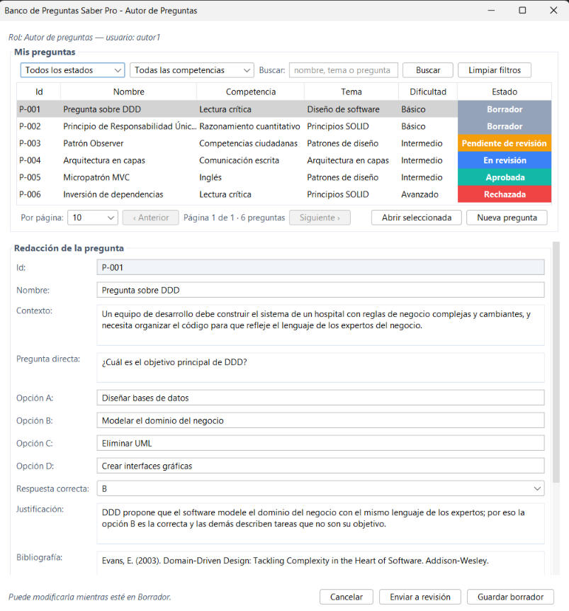

Figura 1 Formulario con todos los campos de la pregunta (criterio 1).

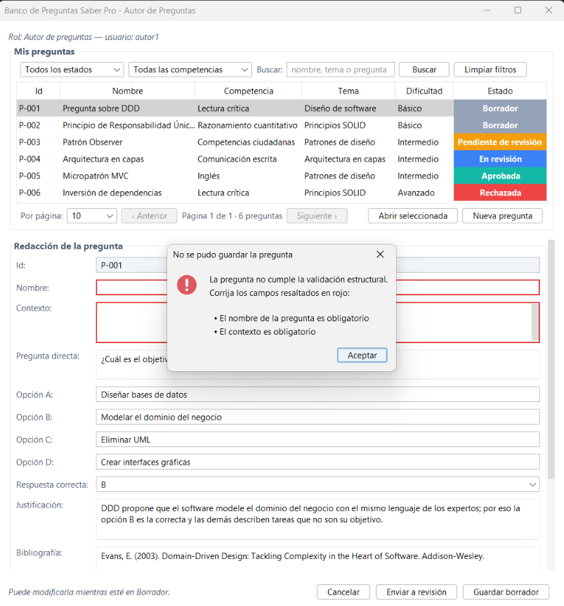

Figura 2 Al guardar una pregunta que incumple una regla, no se guarda y se explica qué corregir (criterio 3).

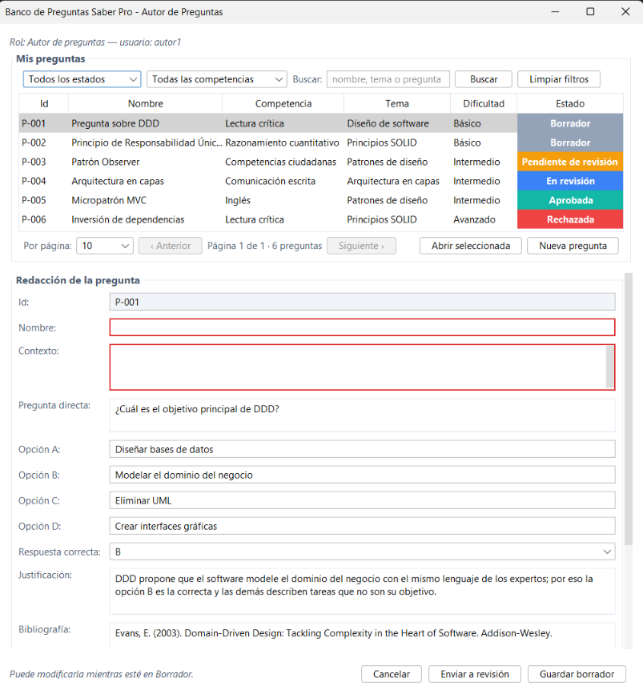

Figura 3 Los campos que incumplen quedan resaltados en rojo (criterio 2).

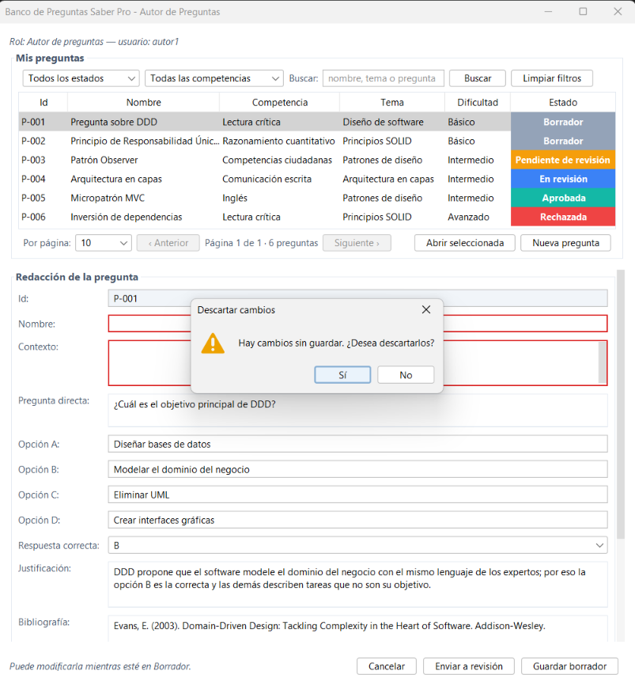

Figura 4 Cancelar con cambios sin guardar pide confirmación (criterio 4).

### HU-02 · Enviar a revisión

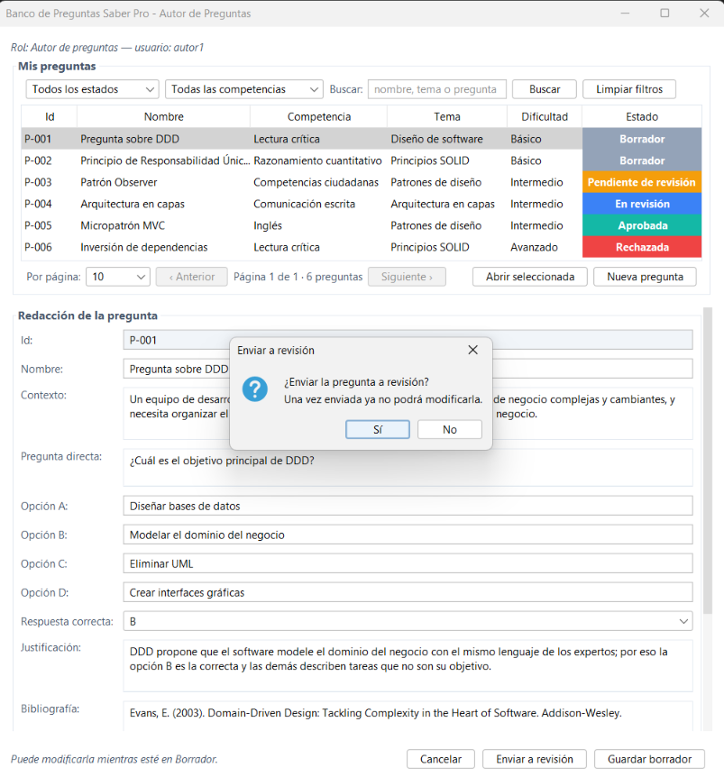

Figura 5 Antes de cambiar el estado aparece un diálogo de confirmación (criterio 3); si se elige "No", la pregunta sigue en Borrador (criterio 4).

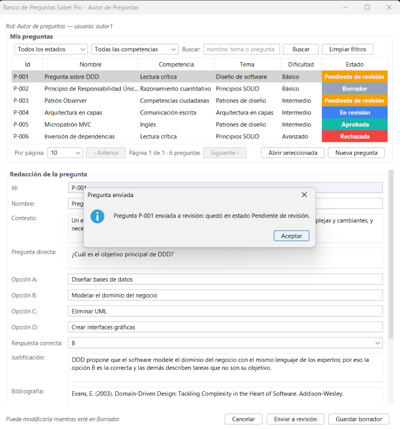

Figura 6 Confirmación de que la pregunta quedó "Pendiente de revisión".

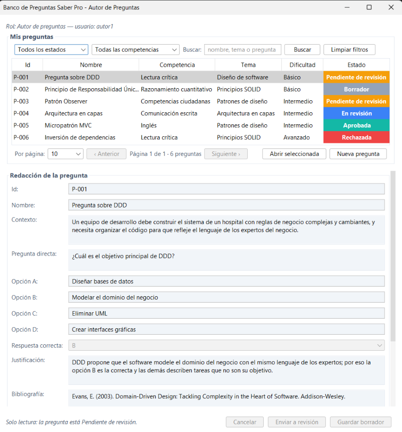

Figura 7 La pregunta aparece en amarillo en el listado y el formulario queda de solo lectura (criterio 1).

### HU-03 · Mis preguntas

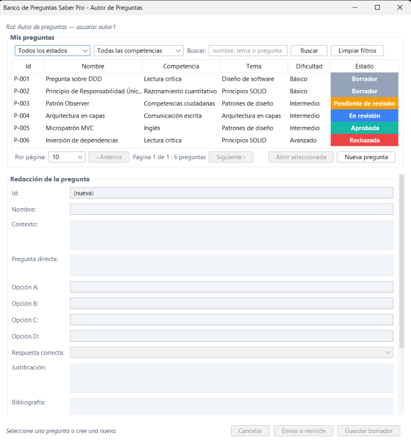

Figura 8 Tabla paginada de a 10, con el estado de cada pregunta en color (criterio 1).

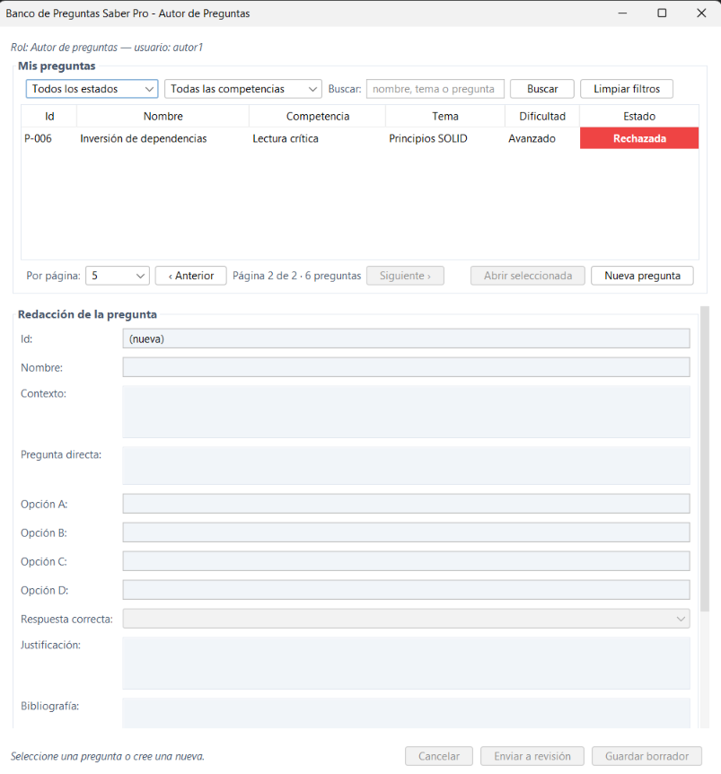

Figura 9 También se puede ver de a 5 o de a 20; aquí, la página 2 de 2.

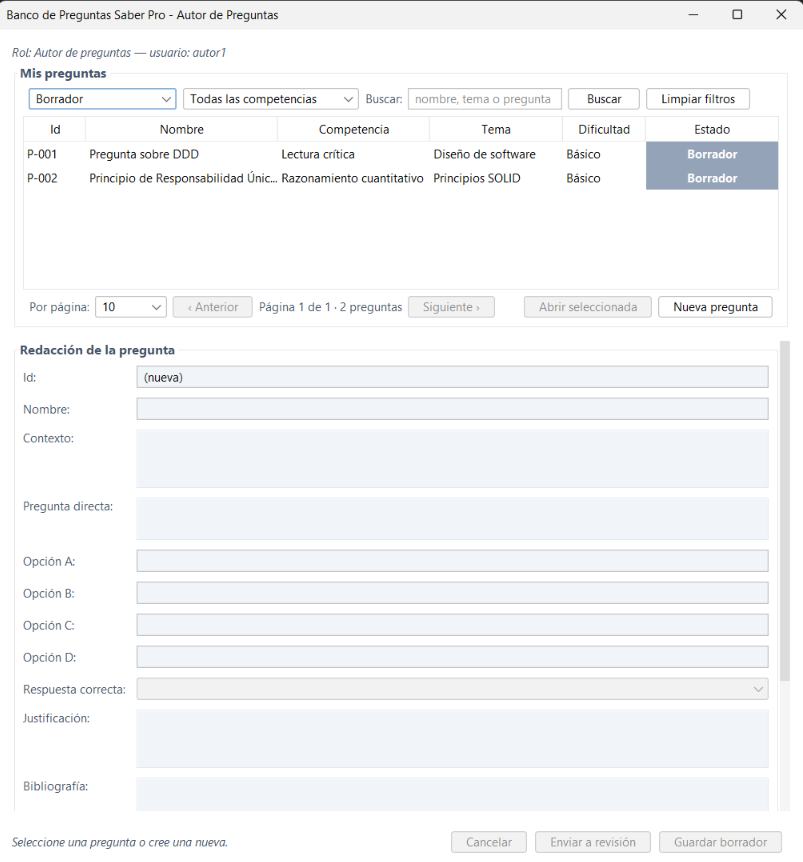

Figura 10 Filtro por estado "Borrador" (criterio 2).

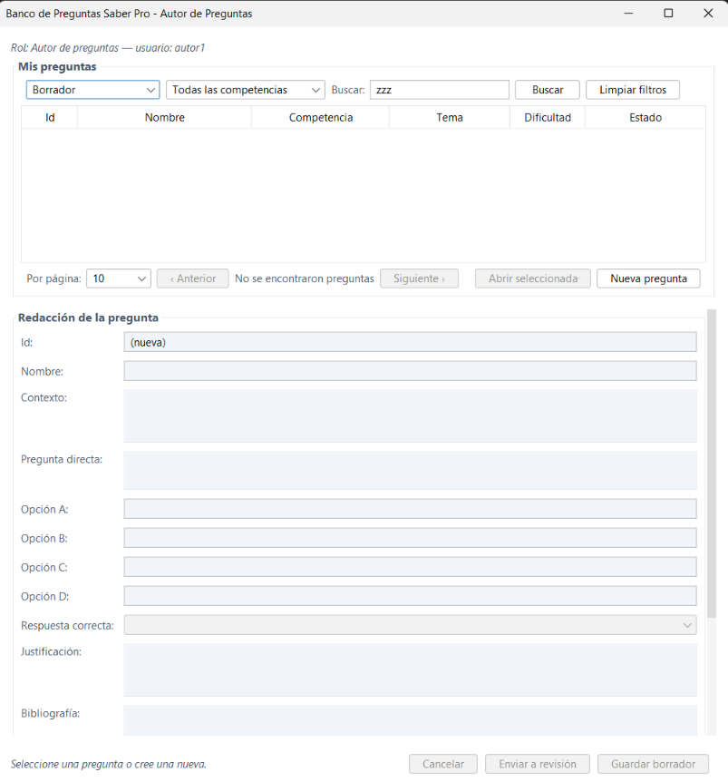

Figura 11 Sin coincidencias: mensaje "No se encontraron preguntas" y botón "Limpiar filtros" (criterio 3).

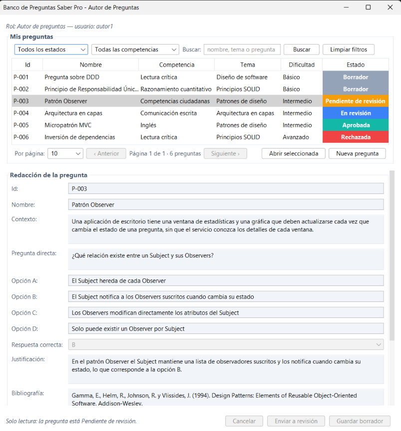

Figura 12 Una pregunta que no está en Borrador se abre de solo lectura (criterio 4).

## 2.3 Evaluación de usabilidad

Se aplican dos técnicas complementarias: una evaluación heurística hecha por el equipo sobre la aplicación de esta iteración, y un test de usabilidad con usuarios con tareas y cuestionario SUS.

### 2.3.1 Evaluación heurística (heurísticas de Nielsen)

Severidad: 0 = no es un problema, 1 = cosmético, 2 = menor, 3 = mayor, 4 = catastrófico.

Lo que cumple

Tabla 6 Heurísticas de Nielsen que cumple la aplicación.

<table><tbody><tr><td>
<strong>Heurística</strong>
</td><td>
<strong>Evidencia en la aplicación</strong>
</td></tr><tr><td>
1. Visibilidad del estado del sistema
</td><td>
El aviso al pie del formulario ("Puede modificarla mientras esté en Borrador" / "Solo lectura: la pregunta está Pendiente de revisión"), el estado en color y "Página 1 de 1 · 6 preguntas".
</td></tr><tr><td>
3. Control y libertad del usuario
</td><td>
Cancelar con confirmación (Figura 4), "Limpiar filtros", diálogo de confirmación antes de enviar a revisión (Figura 5).
</td></tr><tr><td>
4. Consistencia y estándares
</td><td>
Los mismos colores de estado en el listado, la ventana del Revisor y las vistas de estadísticas; misma apariencia en todas las ventanas.
</td></tr><tr><td>
5. Prevención de errores
</td><td>
Solo se edita en Borrador; los botones se deshabilitan según el estado; competencia, dificultad y respuesta se eligen de una lista.
</td></tr><tr><td>
9. Ayudar a reconocer y corregir errores
</td><td>
Un mensaje por cada regla incumplida y los campos afectados en rojo (Figuras 2 y 3).
</td></tr></tbody></table>

Problemas encontrados y mejoras propuestas

Tabla 7 Problemas encontrados en la evaluación heurística y mejoras propuestas.

<table><tbody><tr><td>
<strong>#</strong>
</td><td>
<strong>Problema</strong>
</td><td>
<strong>Heurística</strong>
</td><td>
<strong>Severidad</strong>
</td><td>
<strong>Mejora propuesta</strong>
</td></tr><tr><td>
P1
</td><td>
El nombre largo de una pregunta se corta en la tabla ("Principio de Responsabilidad Únic…")
</td><td>
6. Reconocer antes que recordar
</td><td>
1
</td><td>
Ensanchar la columna o mostrar el nombre completo al pasar el cursor
</td></tr><tr><td>
P2
</td><td>
Los campos del formulario no indican cuáles son obligatorios hasta guardar
</td><td>
5. Prevención de errores
</td><td>
2
</td><td>
Marcar los campos obligatorios con un asterisco
</td></tr><tr><td>
P3
</td><td>
El botón "Cancelar" descarta los cambios, pero su rótulo no lo dice
</td><td>
2. Relación con el mundo real
</td><td>
1
</td><td>
Renombrarlo "Descartar cambios"
</td></tr><tr><td>
P4
</td><td>
Con un filtro aplicado no hay un indicador de que la lista está filtrada, más allá de los controles
</td><td>
1. Visibilidad del estado
</td><td>
2
</td><td>
Mostrar "Filtros activos" junto al total de preguntas
</td></tr><tr><td>
P5
</td><td>
La ventana del Autor es alta (940 px) y en pantallas pequeñas obliga a desplazarse
</td><td>
8. Diseño minimalista
</td><td>
2
</td><td>
Reducir el alto o dividir el formulario en pestañas
</td></tr></tbody></table>

### 2.3.2 Test de usabilidad con usuarios

Objetivo. Comprobar que un autor de preguntas puede crear, enviar a revisión y encontrar sus preguntas sin ayuda, y que un administrador puede asignar revisores.

Participantes. De 3 a 5 personas con el perfil del sistema: docentes o estudiantes de últimos semestres que no participaron en el desarrollo.

Preparación. Ejecutar la aplicación (java -jar app/target/banco-preguntas-saberpro.jar). Usuarios de prueba (contraseña Saber2026!): autor1 (Autor), admin1 (Administrador). La persona evaluadora no explica cómo se usa el sistema: solo lee la tarea y observa.

Tareas

Tabla 8 Tareas del test de usabilidad con usuarios.

<table><tbody><tr><td>
<strong>Tarea</strong>
</td><td>
<strong>Enunciado que se le lee al participante</strong>
</td><td>
<strong>Éxito si…</strong>
</td></tr><tr><td>
T1
</td><td>
"Ingrese como

autor1

y redacte una pregunta nueva sobre un tema que usted elija."
</td><td>
Guarda un borrador sin ayuda
</td></tr><tr><td>
T2
</td><td>
"Envíe esa pregunta a revisión."
</td><td>
La pregunta queda "Pendiente de revisión"
</td></tr><tr><td>
T3
</td><td>
"Encuentre todas sus preguntas que estén en Borrador."
</td><td>
Usa el filtro por estado
</td></tr><tr><td>
T4
</td><td>
"Abra una pregunta ya enviada y diga si puede modificarla."
</td><td>
Reconoce que es de solo lectura
</td></tr><tr><td>
T5
</td><td>
"Ingrese como

admin1

y asigne un revisor a una pregunta pendiente."
</td><td>
Asigna al menos un revisor
</td></tr></tbody></table>

Métricas por tarea: completó sin ayuda (sí/no), tiempo en segundos, número de errores y comentarios.

Cuestionario SUS (escala de 1 = totalmente en desacuerdo a 5 = totalmente de acuerdo):

1.  Creo que me gustaría usar este sistema con frecuencia.
2.  Encontré el sistema innecesariamente complejo.
3.  Pensé que el sistema era fácil de usar.
4.  Creo que necesitaría el apoyo de una persona técnica para usarlo.
5.  Encontré que las funciones estaban bien integradas.
6.  Pensé que había demasiada inconsistencia en el sistema.
7.  Imagino que la mayoría de las personas aprendería a usarlo muy rápido.
8.  Encontré el sistema muy incómodo de usar.
9.  Me sentí muy seguro/a usando el sistema.
10.  Necesité aprender muchas cosas antes de poder usarlo.

Cálculo del puntaje SUS. Para las preguntas impares se resta 1 a la respuesta; para las pares se resta la respuesta de 5. Se suman los diez valores y se multiplican por 2,5: el resultado va de 0 a 100 (68 se considera el promedio; por encima de 80, muy bueno).

Resultados

Tabla 9 Resultados del test de usabilidad y puntaje SUS.

<table><tbody><tr><td>
<strong>Participante</strong>
</td><td>
<strong>T1</strong>
</td><td>
<strong>T2</strong>
</td><td>
<strong>T3</strong>
</td><td>
<strong>T4</strong>
</td><td>
<strong>T5</strong>
</td><td>
<strong>Puntaje SUS</strong>
</td><td>
<strong>Observaciones</strong>
</td></tr><tr><td>
P1
</td><td>
Sí (52s)
</td><td>
Sí (15s)
</td><td>
Sí (20s)
</td><td>
No (50s)
</td><td>
Sí (40s)
</td><td>
77,5
</td><td>
1 error en T1 (dejó la bibliografía vacía; corrigió solo al ver el aviso). En T4 pensó que la app se había bloqueado al no poder editar los campos y necesitó una pista para entender que la pregunta quedaba protegida por estar enviada. Sugirió un aviso visual de "Solo lectura" en vez de solo deshabilitar los campos.
</td></tr><tr><td>
P2
</td><td>
Sí (30s)
</td><td>
Sí (10s)
</td><td>
Sí (10s)
</td><td>
Sí (15s)
</td><td>
Sí (20s)
</td><td>
97,5
</td><td>
Completó las 5 tareas sin dudar ni pedir ayuda. Reconoció de inmediato el estado de solo lectura por el comportamiento de los campos. Sugirió agregar atajos de teclado (p. ej. Ctrl+S) para agilizar el diligenciamiento del formulario.
</td></tr><tr><td>
P3
</td><td>
Sí (80s)
</td><td>
Sí (25s)
</td><td>
Sí (35s)
</td><td>
Sí (30s)
</td><td><table><tbody><tr><td></td><td>
No (70s)
</td></tr></tbody></table></td><td>
62,5
</td><td>
En T1 dudó varias veces por la cantidad de campos del formulario. En T3 no usó el filtro por estado: bajó manualmente por la tabla hasta encontrar los borradores. En T5 no encontró el botón de cerrar sesión y necesitó una pista para cambiar de usuario. Sugirió dividir el formulario de creación en pasos y hacer más visible el botón de cerrar sesión.
</td></tr><tr><td>
<strong>Promedio / % de éxito</strong>
</td><td>
100%
</td><td>
100%
</td><td>
100%
</td><td>
67%
</td><td>
67%
</td><td>
79,2
</td><td>
T3 se completó siempre, pero 1 de 3 no usó el filtro previsto. T4 y T5 tuvieron 1 caso cada uno que necesitó una pista del evaluador (visibilidad del estado de solo lectura y ubicación del botón de cerrar sesión).
</td></tr></tbody></table>

Participantes:

-   P1 = Sebastián Ruiz Segura
-   P2 = Jhoiner Alberto Puentes Figueroa
-   P3 = José David Ospina

Cómo se usan los resultados. Los problemas que aparezcan en dos o más participantes se agregan a la tabla de problemas de la evaluación heurística con su severidad y se priorizan para la siguiente iteración.

# 3\. Planificación de tareas del Sprint 1

La planificación se lleva en Jira, en el tablero SCRUM Sprint 1: [abrir el tablero.](https://dvlasz.atlassian.net/jira/software/projects/SCRUM/boards/1)

Tabla 10 Datos generales del Sprint 1.

<table><tbody><tr><td>
<strong>Dato</strong>
</td><td>
<strong>Valor</strong>
</td></tr><tr><td>
Sprint
</td><td>
SCRUM Sprint 1
</td></tr><tr><td>
Inicio
</td><td>
17 de septiembre de 2026
</td></tr><tr><td>
Fin
</td><td>
26 de septiembre de 2026
</td></tr><tr><td>
Objetivo
</td><td>
Continuar la épica HE-01 (HU-01, HU-02, HU-03) y empezar HE-02 (HU-04) para la sustentación del primer corte
</td></tr></tbody></table>

Pantallazo del tablero Jira, Sprint 1 (todas las historias y subtareas en estado "Finalizada" al cierre del primer corte):

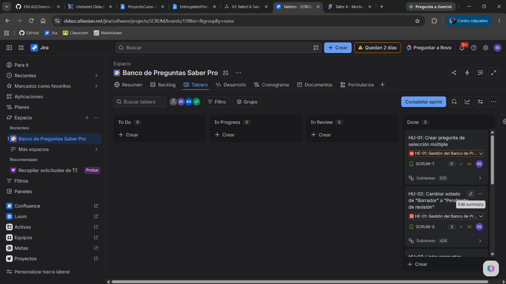

Figura 13 Tablero SCRUM Sprint 1 en Jira, con todas las historias y subtareas en "Finalizada".

## Historias del sprint

Tabla 11 Historias del Sprint 1, puntos y responsables.

<table><tbody><tr><td>
<strong>Historia</strong>
</td><td>
<strong>Descripción</strong>
</td><td>
<strong>Puntos</strong>
</td><td>
<strong>Responsable</strong>
</td></tr><tr><td>
HU-01 (SCRUM-7)
</td><td>
Crear pregunta de selección múltiple
</td><td>
5
</td><td>
Edward Esteban Dávila Salazar
</td></tr><tr><td>
HU-02 (SCRUM-8)
</td><td>
Cambiar el estado de "Borrador" a "Pendiente de revisión"
</td><td>
3
</td><td>
Edward Esteban Dávila Salazar
</td></tr><tr><td>
HU-03 (SCRUM-9)
</td><td>
Listar preguntas creadas
</td><td>
5
</td><td>
Edward Esteban Dávila Salazar
</td></tr><tr><td>
HU-04 (SCRUM-24)
</td><td>
Asignar revisor a preguntas pendientes de revisión
</td><td>
5
</td><td>
Kevin Yesid Castaño Herrera
</td></tr><tr><td>
HU-T6 (SCRUM-30)
</td><td>
Exponer el CRUD de preguntas como microservicio REST (Taller 6)
</td><td>
5
</td><td>
Laura Isabel Sánchez Fernández
</td></tr></tbody></table>

Cada historia se divide en subtareas técnicas (diseñar la pantalla, implementar la validación, implementar la lógica, escribir las pruebas y verificar manualmente los criterios de aceptación).

# 4\. Atributos de calidad y escenario de modificabilidad

## 4.1 Atributos de calidad relevantes para esta iteración

Tabla 12 Atributos de calidad relevantes de la iteración.

<table><tbody><tr><td>
<strong>Atributo</strong>
</td><td>
<strong>Por qué importa en el banco de preguntas</strong>
</td><td>
<strong>Cómo se atiende</strong>
</td></tr><tr><td>
<strong>Modificabilidad</strong>

(principal)
</td><td>
Las reglas de validación, los estados de una pregunta y las formas de notificar cambian con el uso; además el proyecto migrará a microservicios
</td><td>
Módulos Maven con dependencias en una sola dirección; interfaces (puertos) entre capas; una regla de validación por clase; inyección de dependencias en un único punto (

MainApp

)
</td></tr><tr><td>
<strong>Testabilidad</strong>
</td><td>
La rúbrica exige pruebas unitarias a las clases del dominio y las vistas Swing son difíciles de probar
</td><td>
El dominio no depende de Swing; los controladores hablan con la vista por una interfaz y se prueban con una vista falsa; los repositorios y notificadores se reemplazan por dobles de prueba
</td></tr><tr><td>
<strong>Usabilidad</strong>
</td><td>
Los autores redactan preguntas largas y no deben perder trabajo ni equivocarse de estado
</td><td>
Estados con color, campos en rojo, confirmaciones antes de enviar o descartar, formulario de solo lectura fuera de Borrador
</td></tr></tbody></table>

## 4.2 Escenario de calidad de modificabilidad

Escenario principal: agregar una regla de validación estructural.

Tabla 13 Escenario de calidad de modificabilidad.

<table><tbody><tr><td>
<strong>Elemento</strong>
</td><td>
<strong>Descripción</strong>
</td></tr><tr><td>
<strong>Fuente del estímulo</strong>
</td><td>
El coordinador del banco de preguntas (cliente)
</td></tr><tr><td>
<strong>Estímulo</strong>
</td><td>
Solicita una regla nueva de validación estructural: "la pregunta directa no debe superar 300 caracteres"
</td></tr><tr><td>
<strong>Artefacto</strong>
</td><td>
El módulo de validación estructural (

modulo-preguntas

, paquete

domain.validation

)
</td></tr><tr><td>
<strong>Entorno</strong>
</td><td>
Tiempo de desarrollo; el sistema ya está funcionando y las reglas RF-08 a RF-13 están implementadas
</td></tr><tr><td>
<strong>Respuesta</strong>
</td><td>
El desarrollador crea una clase que implementa

ValidationRule

con la nueva regla y la agrega a la lista de

QuestionValidator.porDefecto()

. La regla se aplica automáticamente al guardar y al enviar a revisión, tanto en la aplicación de escritorio como en el servicio REST
</td></tr><tr><td>
<strong>Medida de la respuesta</strong>
</td><td>
Se crea

<strong>1 clase</strong>

(unas 15 líneas) y se modifica

<strong>1 línea</strong>

; se modifican

<strong>0 líneas</strong>

de

QuestionService

, de los controladores y de las vistas; el cambio y su prueba toman

<strong>menos de una hora</strong>

; las pruebas existentes siguen en verde
</td></tr><tr><td>
<strong>Resultado esperado</strong>
</td><td>
La regla nueva funciona en todos los puntos de entrada sin tocar la lógica de negocio ni la interfaz, y el resto del sistema no se ve afectado
</td></tr></tbody></table>

Por qué se puede cumplir.QuestionValidator recibe una lista de reglas y las ejecuta todas; no conoce ninguna regla concreta. QuestionService solo llama al validador, y la interfaz solo muestra las violaciones que este devuelve. Las siete reglas actuales ya se construyeron así, cada una como una clase independiente, sin modificar el servicio.

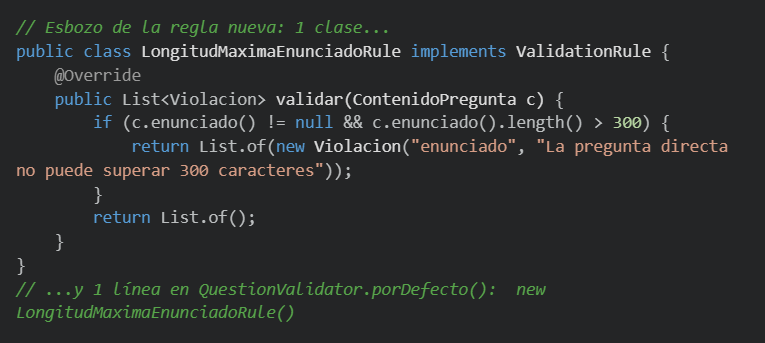

Figura 14 Esbozo de una regla de validación nueva (1 clase) y su registro en QuestionValidator.

## 4.3 Otros escenarios que la arquitectura también soporta

Tabla 14 Otros escenarios de modificabilidad soportados por la arquitectura.

<table><tbody><tr><td>
<strong>Cambio solicitado</strong>
</td><td>
<strong>Qué se toca</strong>
</td><td>
<strong>Qué NO se toca</strong>
</td><td>
<strong>Evidencia</strong>
</td></tr><tr><td>
Guardar las preguntas en una base de datos en vez de en memoria
</td><td>
Una clase nueva que implemente

QuestionRepository

y la línea donde se arma en

MainApp
</td><td>
QuestionService

,

Question

, los controladores y las vistas
</td><td>
Ya ocurrió en el Taller 6:

QuestionJpaAdapter

(JPA + H2) implementa el mismo puerto

QuestionRepository

y reutiliza el dominio sin cambiarlo
</td></tr><tr><td>
Enviar el correo de asignación de revisores por SMTP real en vez del simulado
</td><td>
Una clase nueva que implemente

NotificadorAsignacion

y una línea en

MainApp
</td><td>
AsignacionRevisionService
</td><td>
AsignacionRevisionService

depende de la interfaz

NotificadorAsignacion

, no de

NotificadorCorreoSimulado
</td></tr><tr><td>
Que el Revisor vea solo las preguntas que le asignaron
</td><td>
Cambiar la fuente de preguntas que se le entrega a

GUIRevisor
</td><td>
La ventana ni el controlador del Revisor
</td><td>
FuenteDePreguntasParaRevisar

(Strategy) permite cambiar la fuente sin tocar

RevisionController
</td></tr><tr><td>
Agregar un tipo de pregunta nuevo (por ejemplo, con imagen)
</td><td>
Un plugin nuevo y una línea en

plugins.properties
</td><td>
El núcleo del microkernel
</td><td>
Arquitectura Microkernel del Taller 5: los plugins se cargan por reflexión
</td></tr></tbody></table>

## 4.4 Tácticas de modificabilidad aplicadas

Tabla 15 Tácticas de modificabilidad aplicadas.

<table><tbody><tr><td>
<strong>Táctica</strong>
</td><td>
<strong>Dónde se aplica</strong>
</td></tr><tr><td>
Aumentar la cohesión (una responsabilidad por clase)
</td><td>
Una regla de validación por clase; un controlador por ventana;

EstadoPregunta

concentra las transiciones válidas
</td></tr><tr><td>
Reducir el acoplamiento con interfaces
</td><td>
QuestionRepository

,

SimulacroRepository

,

AsignacionRevisionRepository

,

NotificadorAsignacion

,

DirectorioRevisores

,

RedaccionPreguntaVista

,

RevisionVista
</td></tr><tr><td>
Restringir las dependencias
</td><td>
Módulos Maven:

modulo-preguntas

y

modulo-usuarios

no dependen de nadie; el grafo no tiene ciclos y

app

es el único que conoce a todos
</td></tr><tr><td>
Diferir el enlace
</td><td>
Composition root (

MainApp

) que arma las dependencias; plugins cargados por reflexión desde un archivo de propiedades
</td></tr></tbody></table>

# 5\. Arquitectura y diseño de software (modelo C4 y UML)

## 5.1 Estilo arquitectónico

La aplicación es una aplicación de escritorio en Java (Swing) con una arquitectura monolítica en tres capas, organizada como un monolito modular (módulos Maven que se empaquetan en un solo .jar) y con el micropatrón MVC en las ventanas. La docente pidió el monolito modular porque el proyecto migrará a microservicios: si cada módulo ya tiene límites explícitos, más adelante solo hay que cambiar las llamadas entre módulos por llamadas de red.

Las tres capas de cada módulo:

Tabla 16 Capas de cada módulo y su responsabilidad.

<table><tbody><tr><td>
<strong>Capa</strong>
</td><td>
<strong>Paquete</strong>
</td><td>
<strong>Responsabilidad</strong>
</td></tr><tr><td>
Presentación
</td><td>
presentation

(ui en modulo-usuarios)
</td><td>
Ventanas Swing (vistas) y controladores MVC
</td></tr><tr><td>
Dominio (lógica de negocio)
</td><td>
domain
</td><td>
Entidades, reglas, servicios e interfaces (puertos) de los repositorios
</td></tr><tr><td>
Acceso a datos
</td><td>
access
</td><td>
Implementaciones de los repositorios (memoria o SQLite)
</td></tr></tbody></table>

Las capas se comunican en un solo sentido: presentación → dominio ← acceso a datos. El dominio define las interfaces y el acceso a datos las implementa (inversión de dependencias), de modo que el dominio no conoce ni Swing ni la base de datos.

### Módulos y dependencias

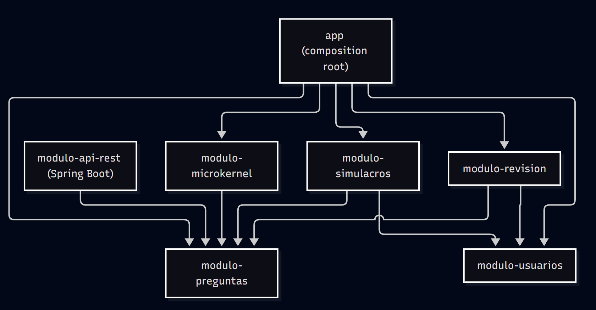

Figura 15 Módulos del proyecto y sus dependencias.

Tabla 17 Módulos del proyecto, su contenido e historias asociadas.

<table><tbody><tr><td>
<strong>Módulo</strong>
</td><td>
<strong>Contenido</strong>
</td><td>
<strong>Historias</strong>
</td></tr><tr><td>
modulo-usuarios
</td><td>
Login, registro, roles, cifrado de contraseñas (Argon2id), SQLite
</td><td>
Acceso al sistema
</td></tr><tr><td>
modulo-preguntas
</td><td>
Pregunta, validación estructural, ciclo de vida, listado, ventanas del Autor y del Revisor
</td><td>
HU-01, HU-02, HU-03
</td></tr><tr><td>
modulo-revision
</td><td>
Asignación de revisores y correo simulado
</td><td>
HU-04
</td></tr><tr><td>
modulo-simulacros
</td><td>
Generación y presentación de simulacros
</td><td>
Fuera del primer corte
</td></tr><tr><td>
modulo-microkernel
</td><td>
Generación de preguntas por plugins (Taller 5)
</td><td>
Fuera del primer corte
</td></tr><tr><td>
modulo-api-rest
</td><td>
Microservicio REST con Spring Boot y JPA (Taller 6)
</td><td>
Fuera del primer corte
</td></tr><tr><td>
app
</td><td>
MainApp

: arma los módulos, define qué ventana abrir según el rol
</td><td>
Todas
</td></tr></tbody></table>

## 5.2 Modelo C4

Los diagramas C4 están en el archivo de diagrams.net 03-TallerC4-SaberPro.drawio, con una página por nivel: [abrir el diagrama](https://app.diagrams.net/#G1P06v2Eww57q3xeCN8tEg0mBflO3VU5YR).

### Nivel 1 — Contexto

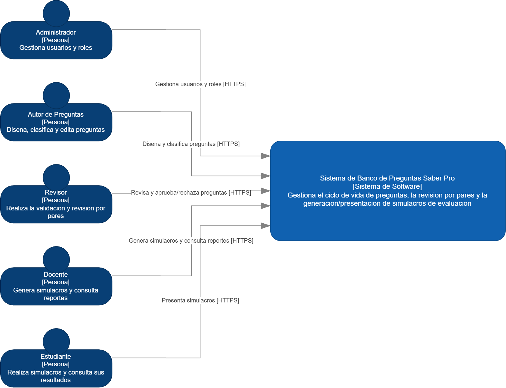

Figura 16 C4-1. Contexto del sistema y sus cinco tipos de usuario.

El Sistema de Banco de Preguntas Saber Pro lo usan cinco tipos de persona:

Tabla 18 Personas que usan el sistema (nivel 1 de C4).

<table><tbody><tr><td>
<strong>Persona</strong>
</td><td>
<strong>Qué hace con el sistema</strong>
</td></tr><tr><td>
Autor de preguntas
</td><td>
Diseña, clasifica y edita preguntas; las envía a revisión (HU-01, HU-02, HU-03)
</td></tr><tr><td>
Administrador
</td><td>
Gestiona usuarios y roles; asigna revisores a las preguntas pendientes (HU-04)
</td></tr><tr><td>
Revisor
</td><td>
Revisa y aprueba o rechaza las preguntas que se le asignan
</td></tr><tr><td>
Docente
</td><td>
Genera simulacros y consulta reportes
</td></tr><tr><td>
Estudiante
</td><td>
Presenta simulacros y consulta sus resultados
</td></tr></tbody></table>

### Nivel 2 — Contenedores

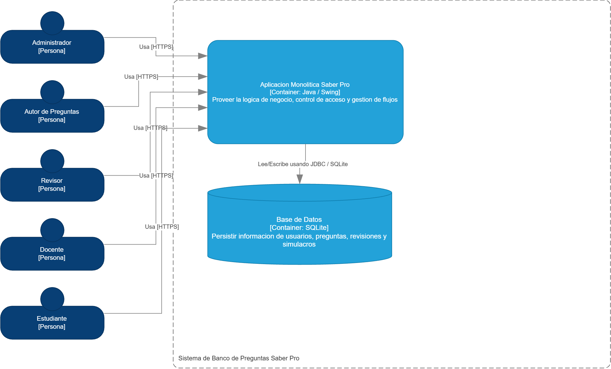

Figura 17 C4-2. Contenedores del sistema.

-   Aplicación monolítica Saber Pro(Java / Swing): contiene toda la lógica de negocio, el control de acceso y la gestión de flujos.
-   Base de datos(SQLite): información del sistema.
-   Aparte, y sin que la aplicación de escritorio dependa de él, el microservicio REST del Taller 6 (Spring Boot, JPA y H2) expone el CRUD de preguntas por HTTP.

Diferencia entre el diseño y esta iteración. En el diseño, la base SQLite guarda usuarios, preguntas, revisiones y simulacros. En el primer corte solo los usuarios están en SQLite; las preguntas, las asignaciones de revisores y los simulacros están en repositorios en memoria detrás de interfaces (QuestionRepository, AsignacionRevisionRepository, SimulacroRepository). Pasarlos a SQLite es cambiar la implementación del repositorio (ver el escenario de modificabilidad).

### Nivel 3 — Componentes

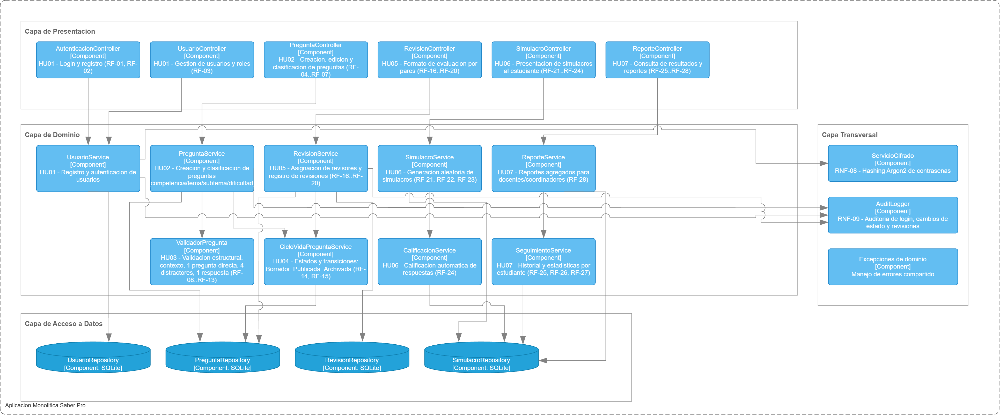

Figura 18 C4-3. Componentes de la aplicación monolítica en sus capas.

El diagrama de componentes agrupa la aplicación en las capas de presentación, dominio, acceso a datos y una capa transversal. Correspondencia entre los componentes del diagrama y las clases implementadas:

Tabla 19 Correspondencia entre los componentes del diagrama y las clases implementadas.

<table><tbody><tr><td>
<strong>Componente del diagrama</strong>
</td><td>
<strong>Clases implementadas</strong>
</td><td>
<strong>Estado en el primer corte</strong>
</td></tr><tr><td>
AutenticacionController, UsuarioController
</td><td>
LoginFrame

,

RegisterFrame

,

DashboardFrame

,

SesionRouter

(

MainApp

)
</td><td>
Implementado
</td></tr><tr><td>
PreguntaController
</td><td>
GUIQuestions

,

RedaccionPreguntaController

,

PanelMisPreguntas

,

MisPreguntasController
</td><td>
Implementado (HU-01 a HU-03)
</td></tr><tr><td>
RevisionController
</td><td>
GUIRevisor

,

RevisionController

,

GUIAsignacionRevisores
</td><td>
Implementado (HU-04)
</td></tr><tr><td>
SimulacroController
</td><td>
GUIDocente

,

GUIEstudiante
</td><td>
Implementado, fuera del primer corte
</td></tr><tr><td>
ReporteController
</td><td>
GUIObserver1

,

GUIObserver2

(estadísticas y gráfica)
</td><td>
Implementado (el Administrador las abre desde el tablero)
</td></tr><tr><td>
UsuarioService
</td><td>
UserService
</td><td>
Implementado
</td></tr><tr><td>
PreguntaService
</td><td>
QuestionService
</td><td>
Implementado
</td></tr><tr><td>
ValidadorPregunta
</td><td>
QuestionValidator

y sus siete

ValidationRule
</td><td>
Implementado (RF-08 a RF-13)
</td></tr><tr><td>
CicloVidaPreguntaService
</td><td>
EstadoPregunta.puedePasarA

,

QuestionService.cambiarEstado

y

enviarARevision
</td><td>
Implementado (RF-14, RF-15)
</td></tr><tr><td>
RevisionService
</td><td>
AsignacionRevisionService
</td><td>
Implementado (HU-04)
</td></tr><tr><td>
SimulacroService, CalificacionService
</td><td>
SimulacroService

,

IntentoSimulacro
</td><td>
Implementado, fuera del primer corte
</td></tr><tr><td>
UsuarioRepository
</td><td>
SqliteUserRepository
</td><td>
Implementado (SQLite)
</td></tr><tr><td>
PreguntaRepository
</td><td>
QuestionImplRepository

(memoria)
</td><td>
Implementado (en memoria)
</td></tr><tr><td>
RevisionRepository
</td><td>
AsignacionRevisionImplRepository

(memoria)
</td><td>
Implementado (HU-04)
</td></tr><tr><td>
SimulacroRepository
</td><td>
SimulacroImplRepository

(memoria)
</td><td>
Implementado (en memoria)
</td></tr><tr><td>
ServicioCifrado
</td><td>
Argon2PasswordHasher
</td><td>
Implementado
</td></tr><tr><td>
AuditLogger, SeguimientoService, ReporteService
</td><td>
—
</td><td>
No se implementan en esta iteración
</td></tr></tbody></table>

### Nivel 4 — Clases (UML)

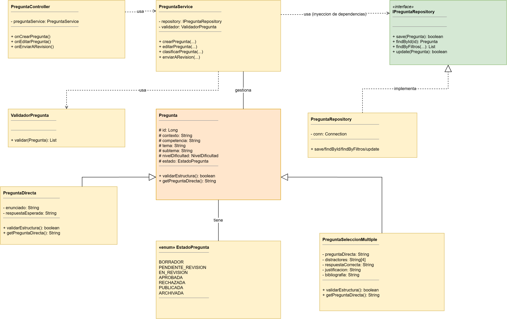

Figura 19 C4-4. Diagrama de clases de diseño de la gestión de preguntas.

Los diagramas siguientes muestran las clases implementadas en esta iteración (las diferencias con el diseño de la Figura 19 C4-4 se explican en la sección de congruencia).

### Dominio de preguntas y validación estructural

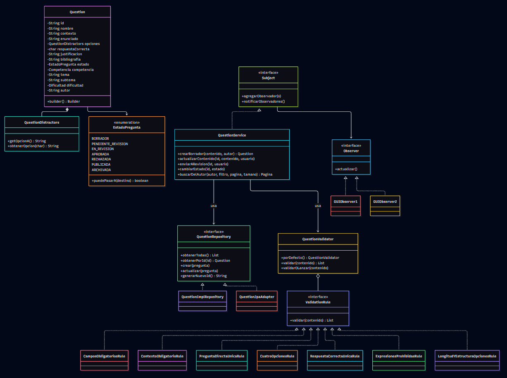

Figura 20 C4-5. Diagrama de clases: dominio de preguntas y validación estructural.

### MVC en las ventanas del Autor y del Revisor

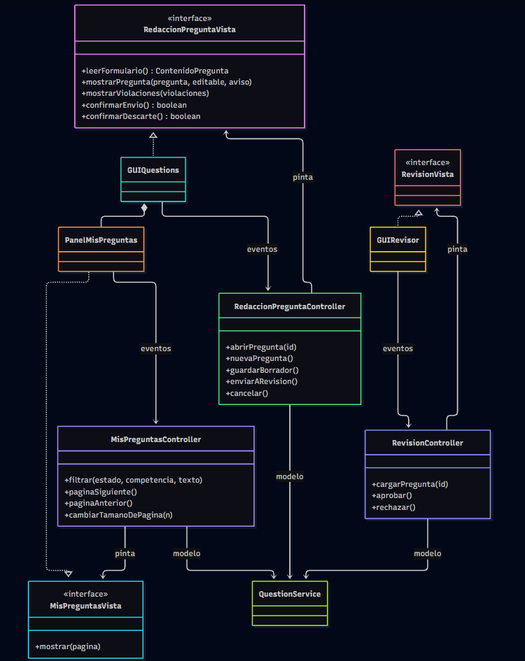

Figura 21 C4-6. Diagrama de clases: MVC en las ventanas del Autor y del Revisor.

### Asignación de revisores (HU-04)

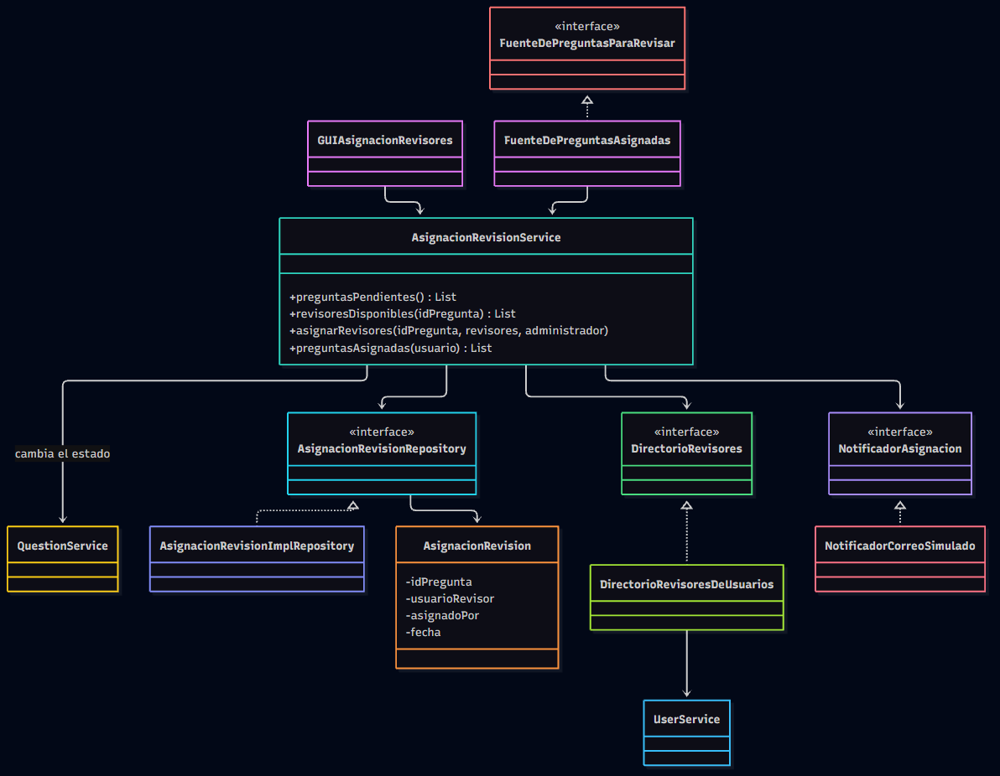

Figura 22 C4-7. Diagrama de clases: asignación de revisores (HU-04).

### Ciclo de vida de una pregunta (RF-14 y RF-15)

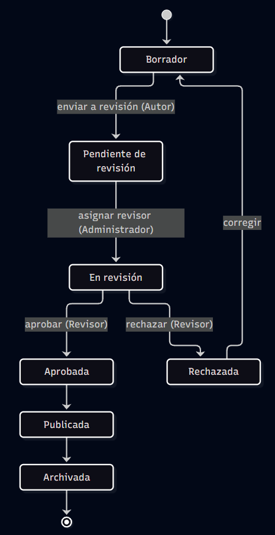

Figura 23 C4-8. Diagrama de estados: ciclo de vida de una pregunta (RF-14 y RF-15).

Desde cualquier estado una pregunta puede pasar a Archivada, porque el requisito RNF-16 prohíbe eliminarlas físicamente.

### Secuencia: enviar una pregunta a revisión (HU-02)

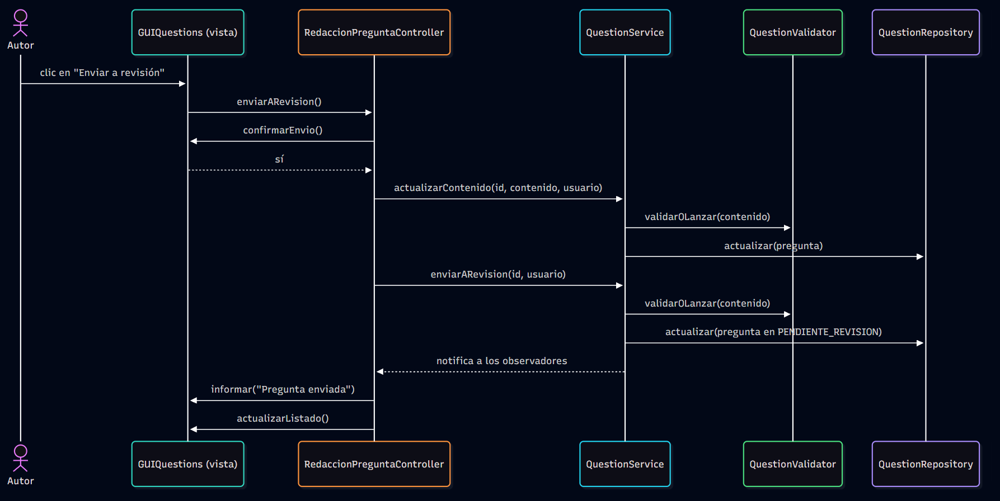

Figura 24 C4-9. Diagrama de secuencia: enviar una pregunta a revisión (HU-02).

### Congruencia entre los diagramas C4 y la implementación

El diseño C4 y el código coinciden en lo esencial: el sistema es una aplicación monolítica en tres capas más una capa transversal; cada pantalla tiene un controlador que usa un servicio de dominio, este usa un repositorio a través de una interfaz y un validador independiente; y el ciclo de vida tiene los mismos siete estados. Las diferencias, con su motivo, son las siguientes.

Tabla 20 Congruencia entre los diagramas C4 y la implementación.

<table><tbody><tr><td>
<strong>Nivel</strong>
</td><td>
<strong>El diagrama muestra</strong>
</td><td>
<strong>La implementación</strong>
</td><td>
<strong>Motivo</strong>
</td></tr><tr><td>
1
</td><td>
Cinco personas usan el sistema
</td><td>
Igual: cinco roles con sus ventanas
</td><td>
—
</td></tr><tr><td>
2
</td><td>
Las personas usan el sistema por HTTPS
</td><td>
Es una aplicación de escritorio: la interfaz es Swing y no hay red
</td><td>
El diseño inicial no distinguía escritorio de web; el enlace HTTPS solo aplica al microservicio REST
</td></tr><tr><td>
2
</td><td>
Una base SQLite guarda usuarios, preguntas, revisiones y simulacros
</td><td>
SQLite guarda solo los usuarios; preguntas, asignaciones y simulacros están en memoria detrás de interfaces
</td><td>
Se priorizó la lógica de negocio del primer corte; cambiar el repositorio no afecta al resto (ver modificabilidad)
</td></tr><tr><td>
2
</td><td>
No aparece el microservicio REST
</td><td>
El módulo

modulo-api-rest

(Spring Boot, JPA y H2) es un contenedor aparte
</td><td>
Se construyó después, en el Taller 6
</td></tr><tr><td>
3
</td><td>
Los componentes se llaman

PreguntaController

,

PreguntaService

,

ValidadorPregunta

, etc.
</td><td>
Se llaman

RedaccionPreguntaController

,

QuestionService

,

QuestionValidator

, etc. (tabla de correspondencia del nivel 3)
</td><td>
Los nombres en el código están en inglés y hay más de un controlador por pantalla
</td></tr><tr><td>
3
</td><td>
AuditLogger

,

SeguimientoService

,

ReporteService
</td><td>
No se implementan en esta iteración
</td><td>
Pertenecen a historias posteriores
</td></tr><tr><td>
3
</td><td>
Las historias se numeran HU01 a HU07
</td><td>
El backlog del equipo numera HU-01 a HU-04 para esta iteración
</td><td>
La numeración del diagrama es la del documento del proyecto (ver la nota de numeración en las historias de usuario)
</td></tr><tr><td>
4
</td><td>
Pregunta

con subclases

PreguntaDirecta

y

PreguntaSeleccionMultiple
</td><td>
Una sola clase

Question

, que es la de selección múltiple con única respuesta
</td><td>
Es el único tipo de pregunta que exige esta iteración
</td></tr><tr><td>
4
</td><td>
id: Long

,

competencia: String

,

nivelDificultad
</td><td>
id: String

(por ejemplo "P-001"),

Competencia

y

Dificultad

como enumeraciones
</td><td>
Evita valores inválidos y hace los filtros más seguros
</td></tr><tr><td>
4
</td><td>
distractores: String[4]

y

respuestaCorrecta: String
</td><td>
Cuatro opciones A a D (

QuestionDistractors

) y

respuestaCorrecta

es la letra de la opción correcta
</td><td>
Decisión D2: las opciones son cuatro y una de ellas es la correcta
</td></tr><tr><td>
4
</td><td>
Pregunta.validarEstructura()

y

ValidadorPregunta.validar(Pregunta)
</td><td>
QuestionValidator

ejecuta siete

ValidationRule

y devuelve todas las violaciones
</td><td>
Decisión D3: la validación vive fuera de la entidad y cada regla es una clase
</td></tr><tr><td>
4
</td><td>
PreguntaService

: crear, editar, clasificar y enviar a revisión
</td><td>
crearBorrador

,

actualizarContenido

,

enviarARevision

,

cambiarEstado

y

buscarDelAutor
</td><td>
La clasificación son campos de la pregunta y no una operación aparte; el listado y sus filtros son parte de la historia HU-03
</td></tr><tr><td>
4
</td><td>
IPreguntaRepository

:

save

,

findById

,

findByFiltros

,

update
</td><td>
QuestionRepository

:

crear

,

actualizar

,

obtenerPorId

,

obtenerTodas

,

generarNuevoId
</td><td>
Los filtros y la paginación se hacen en el servicio (decisión D9)
</td></tr><tr><td>
4
</td><td>
PreguntaRepository

con una conexión SQLite
</td><td>
QuestionImplRepository

en memoria (y

QuestionJpaAdapter

en el microservicio)
</td><td>
Ver el nivel 2
</td></tr><tr><td>
4
</td><td>
PreguntaController

: crear, editar, enviar a revisión
</td><td>
RedaccionPreguntaController

y

MisPreguntasController

, cada uno con su vista por una interfaz
</td><td>
Se aplicó MVC con vistas intercambiables para poder probar la lógica de las ventanas
</td></tr><tr><td>
4
</td><td>
EstadoPregunta

con siete valores
</td><td>
Idéntico
</td><td>
—
</td></tr></tbody></table>

## 5.3 Vista de ejecución

mvn package genera un único app/target/banco-preguntas-saberpro.jar con todas las dependencias. Al ejecutarlo se muestra el login; según el rol del usuario, MainApp abre las ventanas que le corresponden. Al cerrar la ventana principal del rol vuelve el login, para poder cambiar de usuario sin reiniciar (los datos de preguntas viven en memoria).

Tabla 21 Ventanas de la aplicación por rol.

<table><tbody><tr><td>
<strong>Rol</strong>
</td><td>
<strong>Ventanas</strong>
</td></tr><tr><td>
Autor de preguntas
</td><td>
Redacción y listado de preguntas; generador de preguntas por plugins
</td></tr><tr><td>
Administrador
</td><td>
Tablero, estadísticas, gráfica y asignación de revisores
</td></tr><tr><td>
Revisor
</td><td>
Revisión de preguntas
</td></tr><tr><td>
Docente
</td><td>
Generación de simulacros
</td></tr><tr><td>
Estudiante
</td><td>
Presentación de simulacros
</td></tr></tbody></table>

## 5.4 Tecnologías

Java 17 o superior (se desarrolla con 21), Maven, Swing con FlatLaf, SQLite, Argon2id, JUnit 5 y Mockito para las pruebas, y Spring Boot con JPA y H2 en el microservicio REST.

# 6\. Patrones de diseño, principios SOLID y decisiones de diseño

## 6.1 Patrones de diseño implementados

Tabla 22 Patrones de diseño implementados.

<table><tbody><tr><td>
<strong>Patrón</strong>
</td><td>
<strong>Dónde</strong>
</td><td>
<strong>Contexto del problema y cómo se aplicó</strong>
</td></tr><tr><td>
<strong>MVC</strong>

(micropatrón)
</td><td>
GUIQuestions

+

RedaccionPreguntaController

;

PanelMisPreguntas

+

MisPreguntasController

;

GUIRevisor

+

RevisionController
</td><td>
La lógica de cada ventana estaba mezclada con Swing y no se podía probar. La vista solo pinta y le avisa al controlador lo que hace el usuario; el controlador decide y usa el modelo (

QuestionService

). La vista se declara como interfaz (

RedaccionPreguntaVista

,

MisPreguntasVista

,

RevisionVista

), así el controlador se prueba con una vista falsa.
</td></tr><tr><td>
<strong>Observer</strong>
</td><td>
Subject

/

Observer

;

QuestionService

como sujeto;

GUIObserver1

(estadísticas) y

GUIObserver2

(gráfica) como observadores
</td><td>
Las vistas de estadísticas deben actualizarse cada vez que cambia una pregunta, sin que el servicio conozca las ventanas. El servicio notifica y cada vista se refresca sola.
</td></tr><tr><td>
<strong>Builder</strong>
</td><td>
Question.builder()
</td><td>
Una pregunta tiene 14 atributos; un constructor con tantos parámetros es ilegible y propenso a errores de orden. El constructor mantiene las invariantes mínimas y el builder permite armar la pregunta campo a campo.
</td></tr><tr><td>
<strong>Strategy</strong>
</td><td>
ValidationRule

y sus siete reglas;

IMenuProvider

y un menú por rol;

IPasswordHasher

y

IPasswordPolicy

;

FuenteDePreguntasParaRevisar
</td><td>
Cada regla de validación estructural (RF-08 a RF-13) es una estrategia intercambiable que

QuestionValidator

ejecuta sin conocerlas; los menús se eligen según el rol; el Revisor recibe su lista de preguntas de una fuente que se puede cambiar.
</td></tr><tr><td>
<strong>Factory Method y Singleton</strong>
</td><td>
UserRepositoryFactory

,

PasswordHasherFactory

,

PasswordPolicyFactory
</td><td>
El módulo de usuarios entrega su repositorio, su cifrado y su política de contraseñas por defecto a través de una fábrica única, sin que el resto conozca las clases concretas.
</td></tr><tr><td>
<strong>Template Method</strong>
</td><td>
BaseQuestionPlugin.generate

(final) y

construirEnunciado

(abstracto)
</td><td>
Todos los plugins de generación de preguntas validan y construyen la pregunta igual; solo cambia cómo se arma el enunciado.
</td></tr><tr><td>
<strong>Adapter</strong>

(puertos y adaptadores)
</td><td>
QuestionJpaAdapter

(JPA);

DirectorioRevisoresDeUsuarios

;

QuestionImplRepository
</td><td>
Un adaptador conecta una tecnología o módulo externo con la interfaz que espera el dominio: JPA con

QuestionRepository

, y el módulo de usuarios con

DirectorioRevisores

.
</td></tr><tr><td>
<strong>Repository</strong>
</td><td>
QuestionRepository

,

SimulacroRepository

,

AsignacionRevisionRepository

,

IUserRepository
</td><td>
El dominio pide y guarda entidades sin saber si están en memoria, en SQLite o en una base JPA.
</td></tr><tr><td>
<strong>Pipes and Filters</strong>

(arquitectónico)
</td><td>
QuestionPipeline

y cuatro filtros de validación
</td><td>
Las solicitudes de generación de preguntas pasan por filtros encadenados; cada filtro valida una cosa (Taller 5).
</td></tr><tr><td>
<strong>Microkernel</strong>

(arquitectónico)
</td><td>
QuestionMicrokernel

y los plugins de

plugins.properties
</td><td>
Nuevos tipos de pregunta se agregan como plugins cargados por reflexión, sin tocar el núcleo (Taller 5).
</td></tr><tr><td>
<strong>Máquina de estados</strong>
</td><td>
EstadoPregunta.puedePasarA
</td><td>
Las transiciones válidas del ciclo de vida (RF-14, RF-15) viven en un solo lugar y

QuestionService

las aplica.
</td></tr></tbody></table>

## 6.2 Principios SOLID

Tabla 23 Aplicación de los principios SOLID.

<table><tbody><tr><td>
<strong>Principio</strong>
</td><td>
<strong>Cómo se aplica</strong>
</td></tr><tr><td>
<strong>S</strong>

— Responsabilidad única
</td><td>
Cada regla de validación es una clase;

QuestionValidator

solo ejecuta reglas;

QuestionService

coordina el caso de uso; la vista solo pinta y el controlador solo decide.
</td></tr><tr><td>
<strong>O</strong>

— Abierto/cerrado
</td><td>
Agregar una regla de validación, un plugin, un menú de un rol nuevo o un notificador no modifica las clases que los usan (ver el escenario de modificabilidad).
</td></tr><tr><td>
<strong>L</strong>

— Sustitución de Liskov
</td><td>
QuestionImplRepository

(memoria) y

QuestionJpaAdapter

(JPA) son intercambiables donde se espera un

QuestionRepository

; las pruebas del servicio usan dobles y las del microservicio usan JPA.
</td></tr><tr><td>
<strong>I</strong>

— Segregación de interfaces
</td><td>
Interfaces pequeñas y específicas:

NotificadorAsignacion

(un método),

DirectorioRevisores

,

FuenteDePreguntasParaRevisar

,

MisPreguntasVista

; ningún cliente depende de métodos que no usa.
</td></tr><tr><td>
<strong>D</strong>

— Inversión de dependencias
</td><td>
Los servicios dependen de interfaces (

QuestionRepository

,

NotificadorAsignacion

,

DirectorioRevisores

) y no de implementaciones;

MainApp

es el único lugar que las une.
</td></tr></tbody></table>

## 6.3 Decisiones de diseño

Tabla 24 Decisiones de diseño y su motivo.

<table><tbody><tr><td>
<strong>#</strong>
</td><td>
<strong>Decisión</strong>
</td><td>
<strong>Motivo</strong>
</td></tr><tr><td>
D1
</td><td>
Monolito modular con módulos Maven
</td><td>
La docente pidió una arquitectura que permita migrar a microservicios: los límites entre módulos ya están declarados y el grafo de dependencias no tiene ciclos.
</td></tr><tr><td>
D2
</td><td>
La pregunta tiene

<strong>cuatro opciones (A a D)</strong>

, una de ellas correcta
</td><td>
Es el formato de las preguntas Saber Pro. Las opciones incorrectas son los distractores.
</td></tr><tr><td>
D3
</td><td>
La validación estructural vive fuera de la entidad, en

QuestionValidator
</td><td>
La entidad solo protege sus invariantes mínimas; las reglas de negocio se reúnen en un validador que devuelve

<strong>todas</strong>

las violaciones a la vez y que reutilizan la aplicación de escritorio y el servicio REST.
</td></tr><tr><td>
D4
</td><td>
Solo el autor puede modificar su pregunta y solo mientras esté en Borrador
</td><td>
Cumple RF-06 y evita que una pregunta en revisión cambie mientras alguien la evalúa.
</td></tr><tr><td>
D5
</td><td>
El repositorio de preguntas es en memoria detrás de una interfaz
</td><td>
Permite avanzar con la lógica de negocio; cambiar a una base de datos es reemplazar la implementación (ya se hizo en el Taller 6 con JPA).
</td></tr><tr><td>
D6
</td><td>
Las vistas se acceden desde el controlador por una interfaz
</td><td>
Permite probar la lógica de las ventanas sin abrir ninguna ventana.
</td></tr><tr><td>
D7
</td><td>
El correo de asignación de revisores es simulado
</td><td>
El proyecto permite simular las integraciones externas; el servicio depende de

NotificadorAsignacion

, de modo que se puede cambiar por SMTP sin tocarlo.
</td></tr><tr><td>
D8
</td><td>
MainApp

arma las dependencias a mano
</td><td>
Con pocos módulos no se justifica un framework de inyección; el composition root deja explícito cómo se conecta todo.
</td></tr><tr><td>
D9
</td><td>
La búsqueda y la paginación del listado se hacen en el servicio de dominio
</td><td>
Con repositorio en memoria es lo más simple; con una base de datos se traslada a la consulta sin cambiar el controlador ni la vista.
</td></tr><tr><td>
D10
</td><td>
Los estados de una pregunta se muestran con color en toda la aplicación
</td><td>
Lo pide la historia HU-02 y ayuda a reconocer el estado de un vistazo (

EstadoColores

es la única fuente de la paleta).
</td></tr></tbody></table>

# 7\. Pruebas unitarias y organización del repositorio

## 7.1 Pruebas unitarias automatizadas

Hay pruebas unitarias para las entidades y los servicios del dominio de cada módulo, para los controladores de las ventanas y para las reglas de validación. Se ejecutan con JUnit 5 y Mockito:

mvn test

Tabla 25 Pruebas unitarias automatizadas por módulo.

<table><tbody><tr><td>
<strong>Módulo</strong>
</td><td>
<strong>Pruebas</strong>
</td><td>
<strong>Qué cubren</strong>
</td></tr><tr><td>
modulo-usuarios
</td><td>
37
</td><td>
User

,

UserService

, contraseñas (Argon2id y política), repositorio SQLite, menús por rol y su registro, fábricas
</td></tr><tr><td>
modulo-preguntas
</td><td>
154
</td><td>
Question

,

QuestionDistractors

,

ContenidoPregunta

,

EstadoPregunta

,

QuestionService

, las siete reglas de validación y el validador,

FiltroPreguntas

,

Pagina

, búsqueda paginada, los tres controladores de las ventanas
</td></tr><tr><td>
modulo-simulacros
</td><td>
25
</td><td>
Simulacro

,

IntentoSimulacro

,

SimulacroService

, repositorio
</td></tr><tr><td>
modulo-microkernel
</td><td>
39
</td><td>
Microkernel, plugins, filtros y pipeline, solicitud de generación
</td></tr><tr><td>
modulo-revision
</td><td>
23
</td><td>
Revisor

,

AsignacionRevision

, el repositorio y el correo simulados,

DirectorioRevisoresDeUsuarios

,

FuenteDePreguntasAsignadas

y

AsignacionRevisionService

(una prueba por regla de HU-04)
</td></tr><tr><td>
modulo-api-rest
</td><td>
52
</td><td>
Controlador REST, servicio, mapper, adaptador JPA, integración
</td></tr><tr><td>
<strong>Total</strong>
</td><td>
<strong>330</strong>
</td><td></td></tr></tbody></table>

Estilo de las pruebas. Cada prueba sigue Given / When / Then y tiene un nombre que describe el comportamiento (por ejemplo, enviarARevision\_sinConfirmacion\_laPreguntaSigueEnBorrador). Los servicios se prueban con dobles de sus dependencias (Mockito) o con el repositorio en memoria; los controladores se prueban con una vista falsa.

## 7.2 Organización del repositorio

banco-preguntas-saberpro/

├── pom.xml Proyecto padre (módulos y versiones)

├── README.md Descripción, cómo compilar y ejecutar, estado del proyecto

├── docs/ Documentación de arquitectura (esta carpeta)

├── app/ Composition root y ejecutable

├── modulo-usuarios/ Login, registro y roles

├── modulo-preguntas/ Banco de preguntas (HU-01, HU-02, HU-03)

├── modulo-revision/ Asignación de revisores (HU-04, implementado)

├── modulo-simulacros/ Simulacros (docente y estudiante)

├── modulo-microkernel/ Generación de preguntas por plugins

└── modulo-api-rest/ Microservicio REST

Cada módulo tiene su propio pom.xml y, dentro, los paquetes domain, access y presentation de las tres capas.

Cómo compilar y ejecutar

mvn test # todas las pruebas mvn package # genera app/target/banco-preguntas-saberpro.jar java -jar app/target/banco-preguntas-saberpro.jar # abre el login

Usuarios de prueba (contraseña Saber2026!): autor1 (Autor), revisor1 (Revisor), docente1 (Docente), estudiante1 (Estudiante) y admin1 (Administrador).

## 7.3 Trabajo en equipo

-   Tablero de tareas: las historias, sus criterios y sus subtareas están en el tablero de Jira del Sprint 1.
-   Commits: cada integrante del equipo trabaja con su propia identidad de Git, de modo que cada commit queda a nombre de quien lo hizo.
-   Mensajes de commit: describen el cambio en una línea y, cuando corresponde, indican la historia (por ejemplo, "(HU-04)").

# 8\. Enlaces

Tabla 26 Enlaces del proyecto (video, repositorio, Jira, Figma, C4).

<table><tbody><tr><td>
<strong>Recurso</strong>
</td><td>
<strong>URL</strong>
</td></tr><tr><td>
Video de sustentación (YouTube)
</td><td>
<a href="https://youtu.be/xWMwpDzWfwI">https://youtu.be/xWMwpDzWfwI</a>
</td></tr><tr><td>
Repositorio Git del proyecto
</td><td>
<a href="https://github.com/DVLASZ/banco-preguntas-saberpro">https://github.com/DVLASZ/banco-preguntas-saberpro</a>
</td></tr><tr><td>
Tablero de tareas (Jira, Sprint 1)
</td><td>
<a href="https://dvlasz.atlassian.net/jira/software/projects/SCRUM/boards/1">https://dvlasz.atlassian.net/jira/software/projects/SCRUM/boards/1</a>
</td></tr><tr><td>
Prototipos (Figma)
</td><td>
<a href="https://www.figma.com/design/kk6g0a8B4gv7wqCsYRb4Xd/Banco-de-Preguntas-Saber-Pro---Prototipos">https://www.figma.com/design/kk6g0a8B4gv7wqCsYRb4Xd/Banco-de-Preguntas-Saber-Pro---Prototipos</a>

(página "Primer corte - Prototipos HU-01 a HU-04")
</td></tr><tr><td>
Diagramas C4 (diagrams.net)
</td><td>
<a href="https://app.diagrams.net/#G1P06v2Eww57q3xeCN8tEg0mBflO3VU5YR">https://app.diagrams.net/#G1P06v2Eww57q3xeCN8tEg0mBflO3VU5YR</a>
</td></tr></tbody></table>