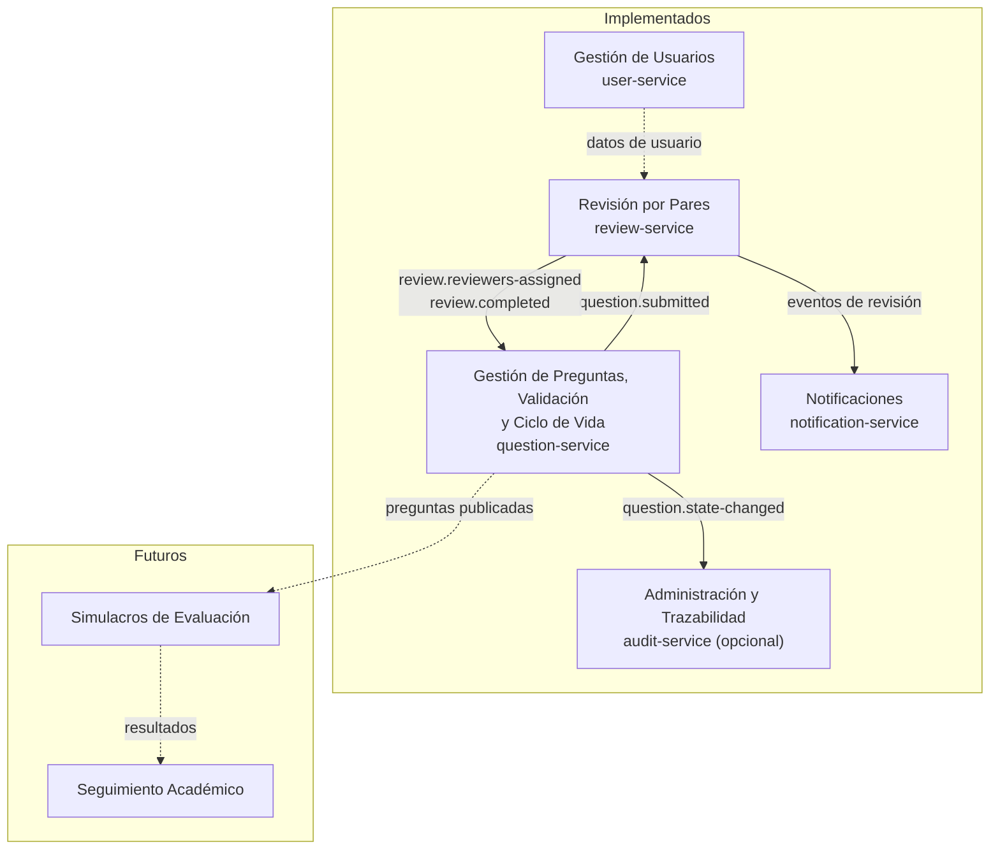
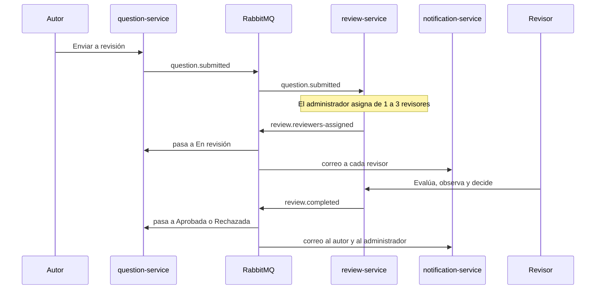

# 02 · Contextos delimitados y eventos

## Contextos delimitados

El docente propone ocho contextos como aproximación. Para las historias de esta iteración (HU-01 a
HU-05) implementamos cinco servicios más el gateway, y dejamos documentados los demás.



| Contexto del docente | Servicio | Alcance |
|---|---|---|
| Gestión de Usuarios | `user-service` | Usuarios precargados, roles (administrador, autor, revisor) y login |
| Gestión de Preguntas | `question-service` | HU-01 a HU-03 |
| Validación de Preguntas | `question-service` | Módulo interno (reglas de validación estructural) |
| Ciclo de Vida de Preguntas | `question-service` | Módulo interno (máquina de estados) |
| Revisión por Pares | `review-service` | HU-04 y HU-05 |
| (transversal) | `notification-service` | Correo y bandeja de notificaciones |
| Administración y Trazabilidad | `audit-service` | Opcional: guarda todos los eventos |
| Simulacros de Evaluación | — | Corte 3 |
| Seguimiento Académico | — | Corte 3 |

**Por qué Validación y Ciclo de Vida no son servicios aparte.** Cada guardado de pregunta ejecuta la
validación y valida la transición de estado. Separarlos añadiría una llamada de red por operación sin
ninguna ventaja de escalado: son reglas que cambian junto con la pregunta. Se conservan como módulos
internos con límites claros.

## Eventos

Comunicación asíncrona por RabbitMQ: exchange `bancopreguntas.events` de tipo *topic*. Cada mensaje lleva
un sobre común y un cuerpo pequeño con identificadores, no copias de las entidades.

```json
{
  "eventId": "uuid",
  "type": "review.completed",
  "occurredAt": "2026-10-06T10:15:30Z",
  "data": {}
}
```

| Evento | Lo publica | Lo consumen | Efecto |
|---|---|---|---|
| `question.submitted` | question-service | review-service, audit-service | Crea el caso de revisión pendiente de asignar |
| `review.reviewers-assigned` | review-service | question-service, notification-service, audit-service | La pregunta pasa a "En revisión"; se avisa a cada revisor |
| `review.evaluation-submitted` | review-service | notification-service, audit-service | Se avisa al administrador y al autor de la nueva evaluación |
| `review.completed` | review-service | question-service, notification-service, audit-service | La pregunta pasa a Aprobada o Rechazada; se avisa a todos |
| `question.state-changed` | question-service | audit-service | Traza del ciclo de vida |

Cuerpo (`data`) de cada evento:

| Evento | Campos |
|---|---|
| `question.submitted` | `questionId`, `authorId`, `title`, `competency` |
| `review.reviewers-assigned` | `questionId`, `authorId`, `reviewerIds[]`, `assignedBy` |
| `review.evaluation-submitted` | `questionId`, `reviewerId`, `decision`, `observation` |
| `review.completed` | `questionId`, `authorId`, `result` (`APPROVED` o `REJECTED`), `observations[]` |
| `question.state-changed` | `questionId`, `from`, `to`, `changedBy` |

Garantías: mensajes persistentes con confirmación de entrega y consumidores **idempotentes** (se ignora un
`eventId` ya procesado).

## Flujo principal


