# 03 · Arquitectura (C4 y UML)

> Cada diagrama de este documento también está como imagen (SVG y PNG) en [`img/diagramas`](img/diagramas/), lista para el documento formal en Word o PDF.

## Estilo arquitectónico

Microservicios orientados a eventos con un API Gateway como único punto de entrada, una base de datos
por servicio y un broker de mensajes para la comunicación entre servicios. Frontend y backend están
separados y se comunican solo por API REST.

## C4 · Nivel 1: contexto del sistema

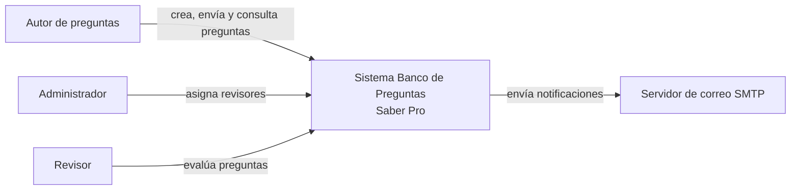

## C4 · Nivel 2: contenedores

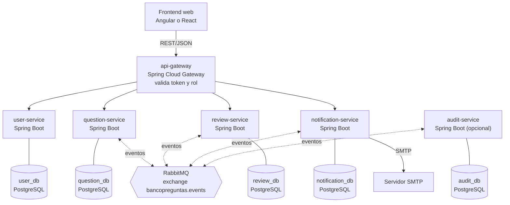

| Contenedor | Responsabilidad | Puerto |
|---|---|---|
| api-gateway | Entrada única, enrutamiento, validación del token y autorización por rol | 8080 |
| user-service | Usuarios precargados, roles, login y lista de revisores | 8081 |
| question-service | Preguntas, validación estructural y ciclo de vida | 8082 |
| review-service | Asignación de revisores, evaluaciones y observaciones | 8083 |
| notification-service | Consume eventos, envía correo y guarda la bandeja | 8084 |
| audit-service | Registra todos los eventos (opcional) | 8085 |
| RabbitMQ | Broker de eventos | 5672, panel 15672 |

## C4 · Nivel 3: componentes

Todos los servicios siguen la misma organización interna: `api`, `application`, `domain` e
`infrastructure`. El dominio no depende de Spring, de modo que en el corte 3 el paso a hexagonal sea un
refinamiento y no una reescritura.

### review-service

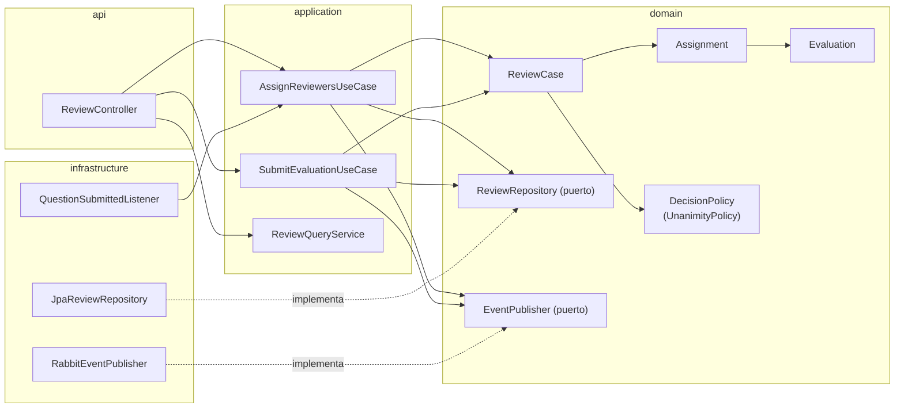

### question-service

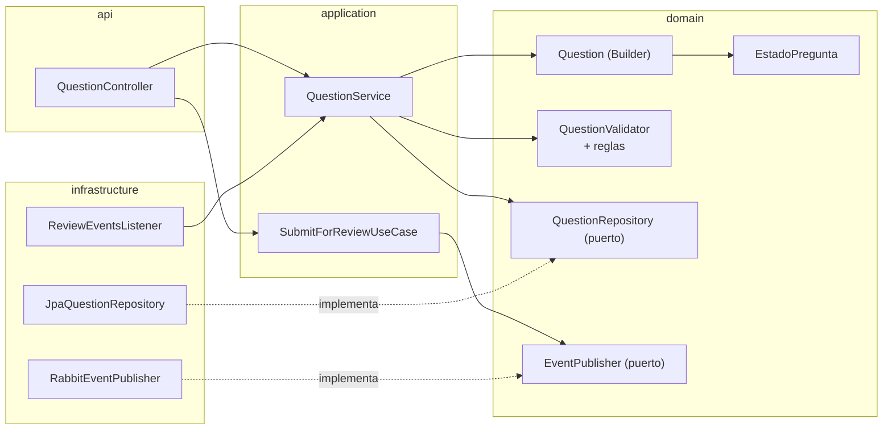

## Máquina de estados de la pregunta

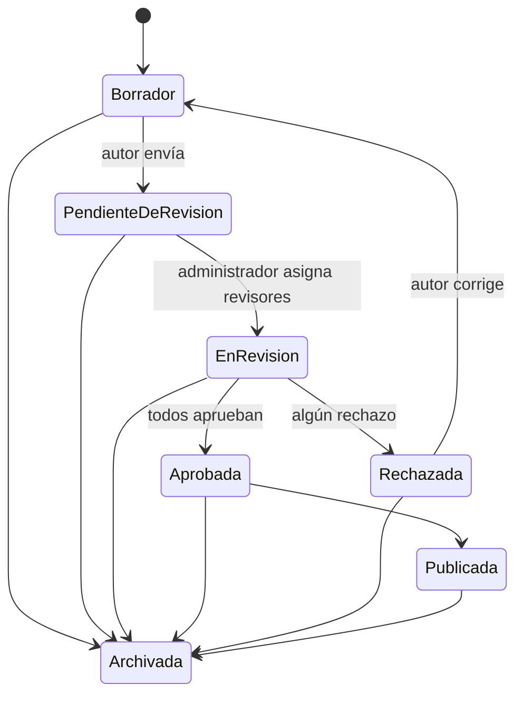

*Pendiente: quién publica y archiva, y qué transiciones no tienen retorno (consulta con el profesor
Libardo). La tabla es la del primer corte.*

## Secuencia · HU-04: asignar revisores

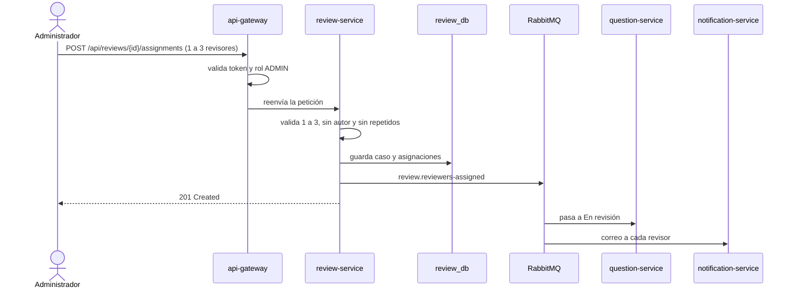

## Secuencia · HU-05: evaluar una pregunta

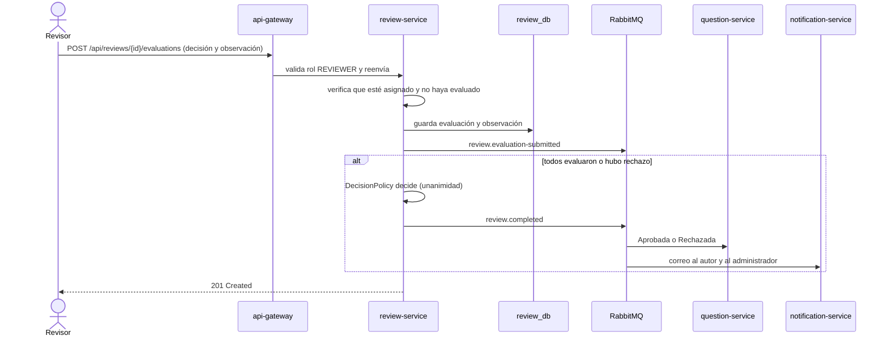

## Modelo de datos por servicio

Los servicios se refieren entre sí solo por identificador, sin claves foráneas entre bases. No hay borrado
físico (RNF-16): se usan estados y fechas.

### user_db

```mermaid
erDiagram
  APP_USER ||--o{ USER_ROLE : tiene
  ROLE ||--o{ USER_ROLE : asigna
  APP_USER {
    uuid id PK
    string username
    string email
    string password_hash
    string full_name
    boolean active
  }
  ROLE {
    int id PK
    string name
  }
  USER_ROLE {
    uuid user_id FK
    int role_id FK
  }
```

### question_db

El modelo conserva las cuatro opciones y la letra de la respuesta correcta, igual que el dominio del primer corte
(`ContenidoPregunta`), para reutilizarlo sin cambios.

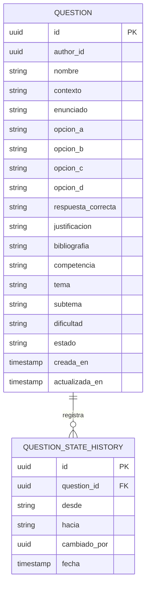

### review_db

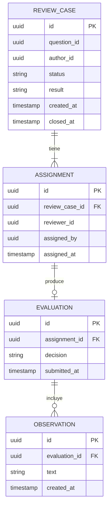

### notification_db y audit_db

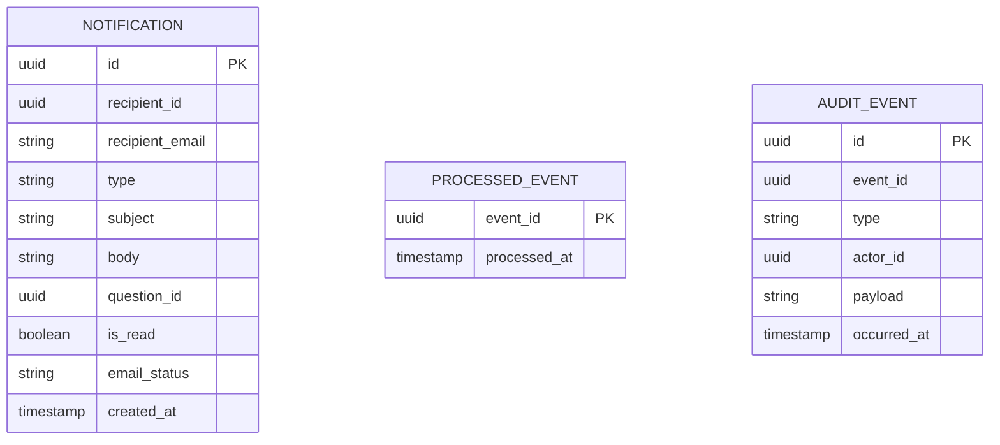

`review_db` y `notification_db` también guardan `PROCESSED_EVENT` para la idempotencia de sus consumidores.

## Despliegue

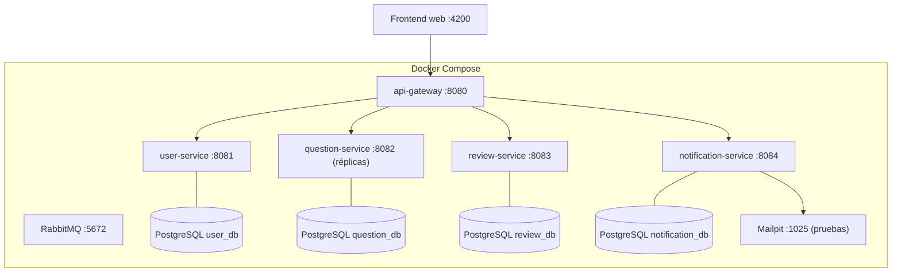
