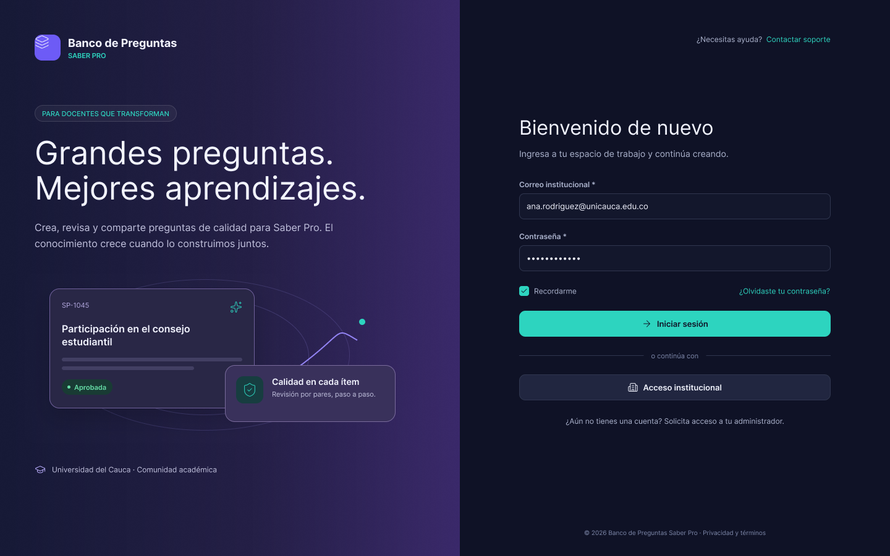
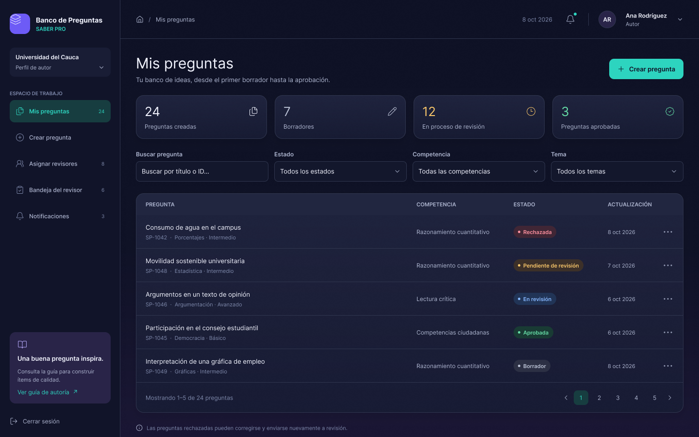
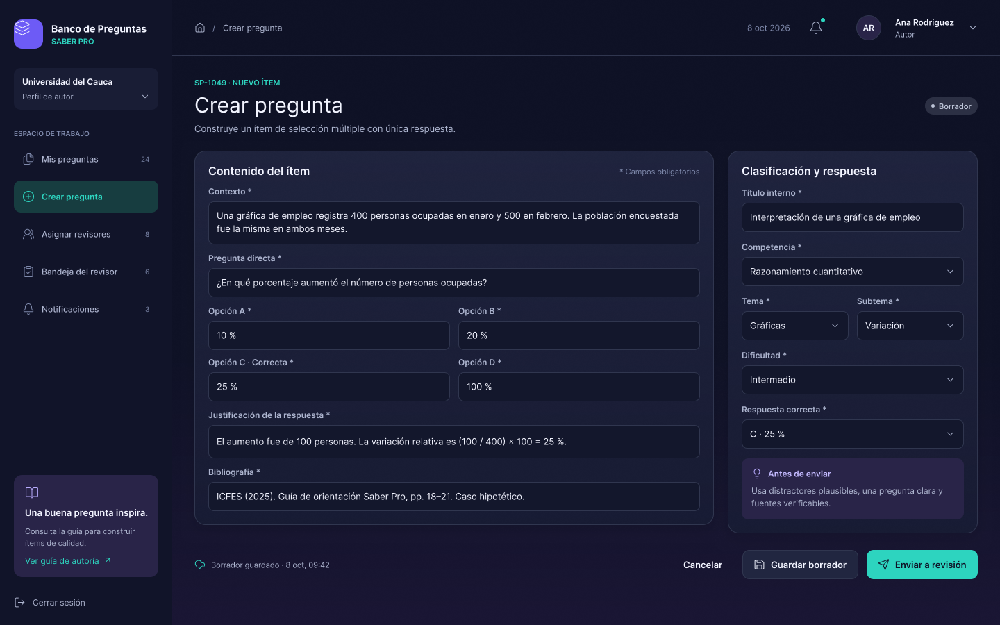
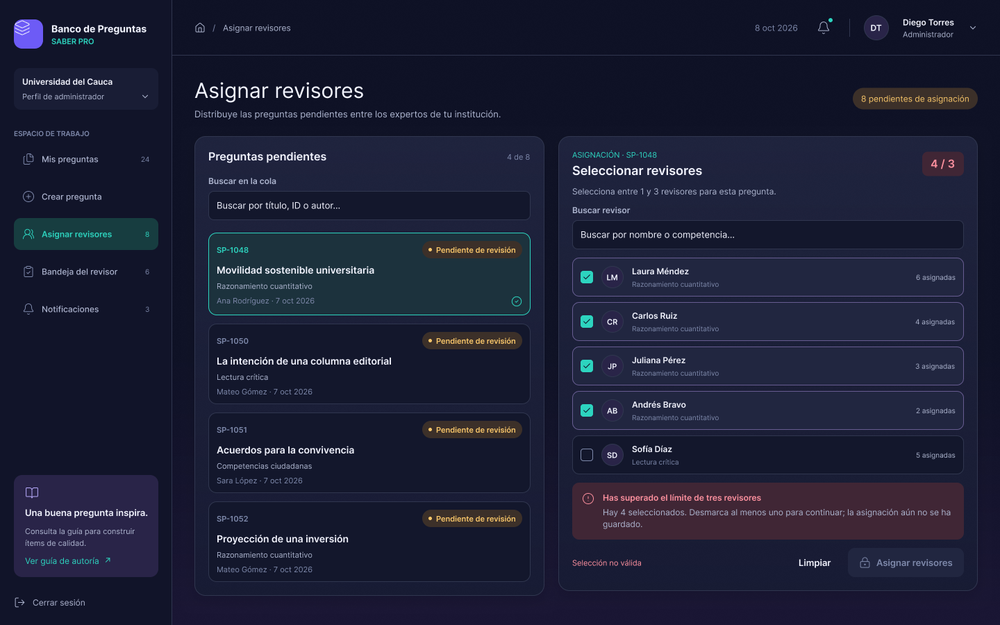
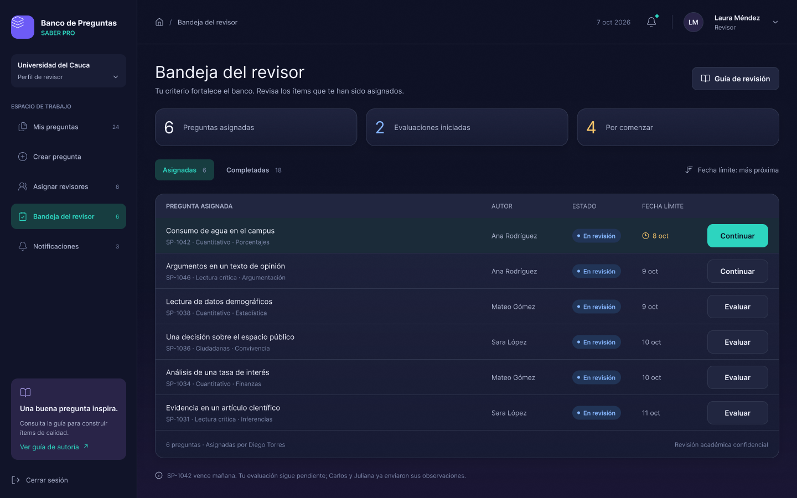
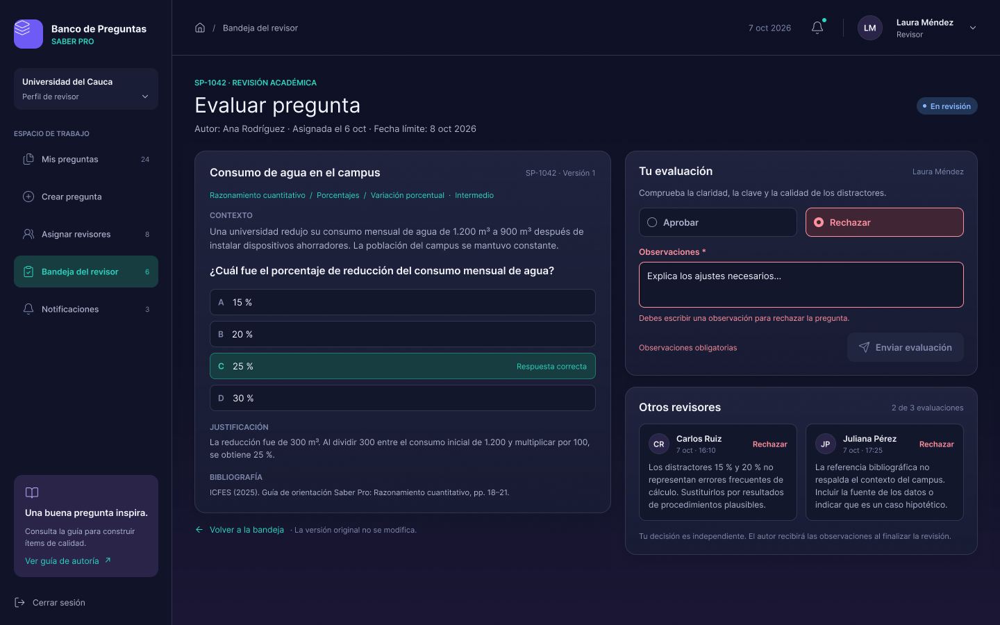
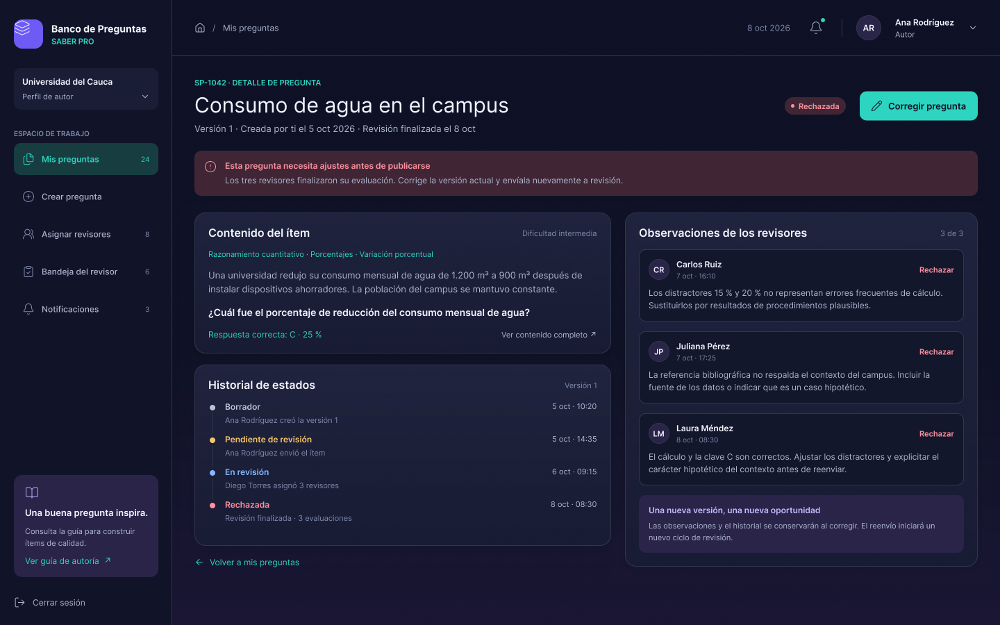
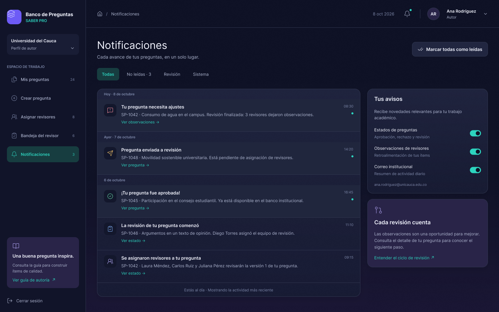

# 06 · Prototipos

El frontend del segundo corte es una aplicación web separada del backend. Los prototipos son de **alta
fidelidad** (marcos de 1440 x 900) y están en Figma, en la página **Corte 2 - Prototipos web (alta
fidelidad)** del archivo
[Banco de Preguntas Saber Pro - Prototipos](https://www.figma.com/design/kk6g0a8B4gv7wqCsYRb4Xd/Banco-de-Preguntas-Saber-Pro---Prototipos?node-id=165-2).
El mismo archivo conserva los prototipos anteriores en sus propias páginas:

| Página del archivo | Contenido |
|---|---|
| Taller 4 - Prototipos base (mockups iniciales) | Mockups iniciales del Taller 4 |
| Primer corte - Prototipos HU-01 a HU-04 | Prototipos detallados de la primera iteración (aplicación de escritorio) |
| Corte 2 - Prototipos web (alta fidelidad) | Prototipos web del segundo corte |

## Lenguaje visual

Interfaz moderna y sobria sobre un fondo índigo oscuro con degradados suaves hacia violeta, un acento turquesa
y tarjetas redondeadas de apariencia translúcida. Se evitó una paleta recargada: el color se reserva para lo
que comunica algo, como los estados de la pregunta.

| Estado | Color |
|---|---|
| Borrador | Gris |
| Pendiente de revisión | Ámbar |
| En revisión | Azul |
| Aprobada | Verde |
| Rechazada | Rojo |

Todas las pantallas comparten la barra lateral de navegación (Mis preguntas, Crear pregunta, Asignar revisores,
Bandeja del revisor, Notificaciones), el encabezado con la campana de notificaciones y el menú de usuario.

## Pantallas

| # | Pantalla | Historia | Imagen |
|---|---|---|---|
| 1 | Inicio de sesión | Seguridad mínima | [01](img/prototipos/01-inicio-de-sesion.png) |
| 2 | Mis preguntas | HU-03 (y estados con color de HU-02) | [02](img/prototipos/02-hu03-mis-preguntas.png) |
| 3 | Crear pregunta | HU-01 | [03](img/prototipos/03-hu01-crear-pregunta.png) |
| 4 | Asignar revisores (1 a 3) | HU-04 | [04](img/prototipos/04-hu04-asignar-revisores.png) |
| 5 | Bandeja del revisor | HU-05 | [05](img/prototipos/05-hu05-bandeja-del-revisor.png) |
| 6 | Evaluar pregunta | HU-05 | [06](img/prototipos/06-hu05-evaluar-pregunta.png) |
| 7 | El autor lee las observaciones | HU-05 | [07](img/prototipos/07-hu05-autor-lee-observaciones.png) |
| 8 | Notificaciones | HU-04 y HU-05 | [08](img/prototipos/08-notificaciones.png) |

### 1. Inicio de sesión

### 2. Mis preguntas (HU-03)

Listado con filtros por estado, competencia y tema, estados en color y paginación.

### 3. Crear pregunta (HU-01)

### 4. Asignar revisores (HU-04)

El administrador elige una pregunta pendiente y marca de 1 a 3 revisores. Con un cuarto revisor se muestra el
error y el botón de asignar queda deshabilitado.

### 5. Bandeja del revisor (HU-05)

### 6. Evaluar pregunta (HU-05)

El revisor lee la pregunta completa, decide aprobar o rechazar y escribe observaciones, obligatorias si
rechaza. A la derecha ve las observaciones de los demás revisores.

### 7. El autor lee las observaciones (HU-05)

### 8. Notificaciones

## Cómo se hicieron

Se generaron con el agente de IA de Figma a partir de una descripción detallada del estilo, los estados y las
ocho pantallas. Después se revisaron a mano para ajustar el contenido al proyecto: nombre de la institución,
dominio del correo y niveles de dificultad (Básico, Intermedio, Avanzado), que son los del dominio.

Los nombres de personas, los códigos de pregunta y las cifras son datos de ejemplo.

## Validación de usabilidad

Pendiente: aplicar el método *thinking aloud* con estas pantallas una vez estén implementadas.
