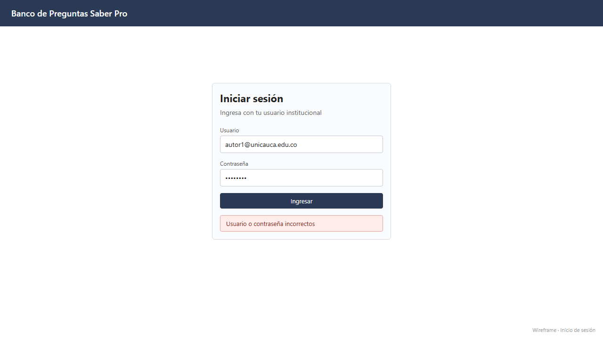
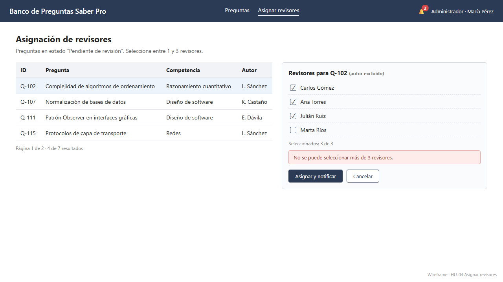
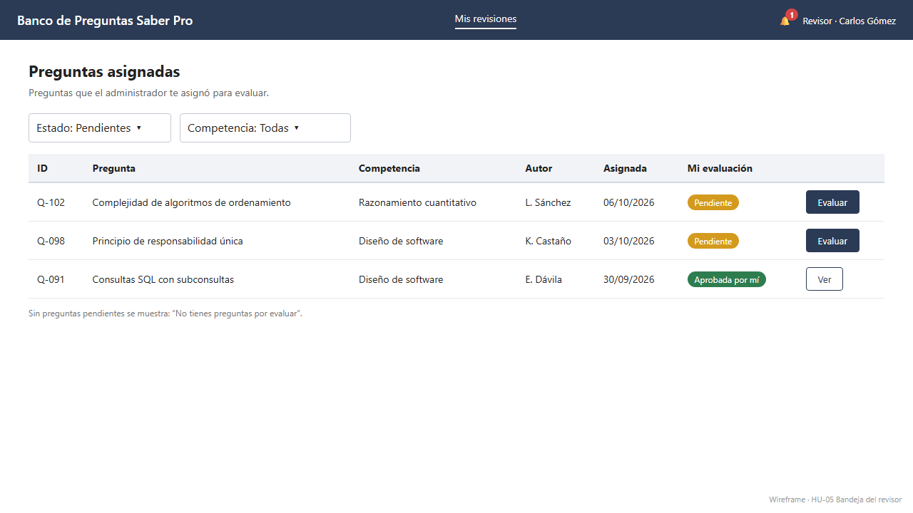
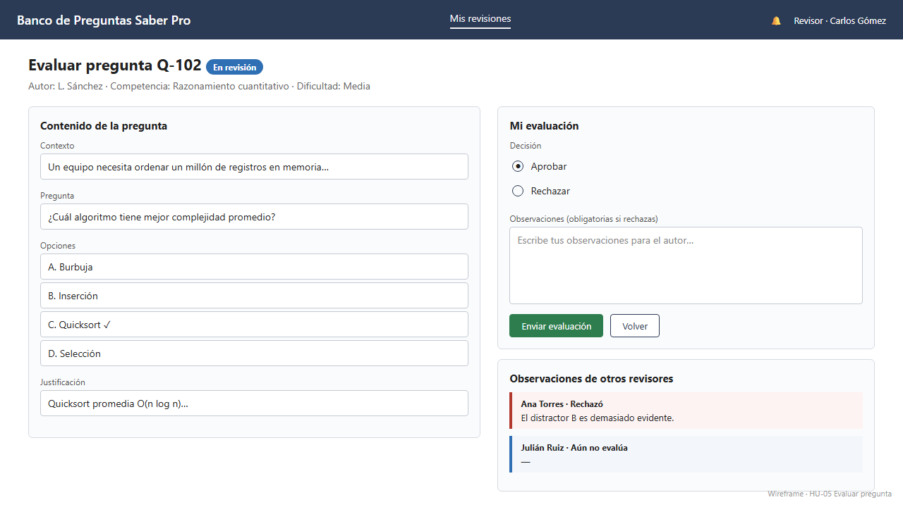
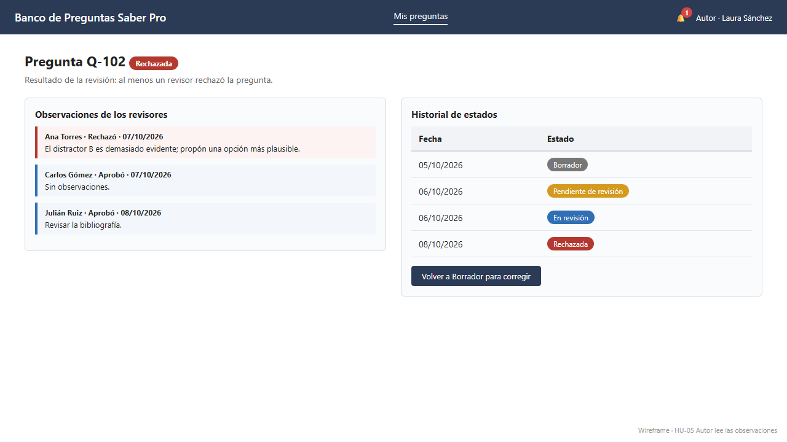
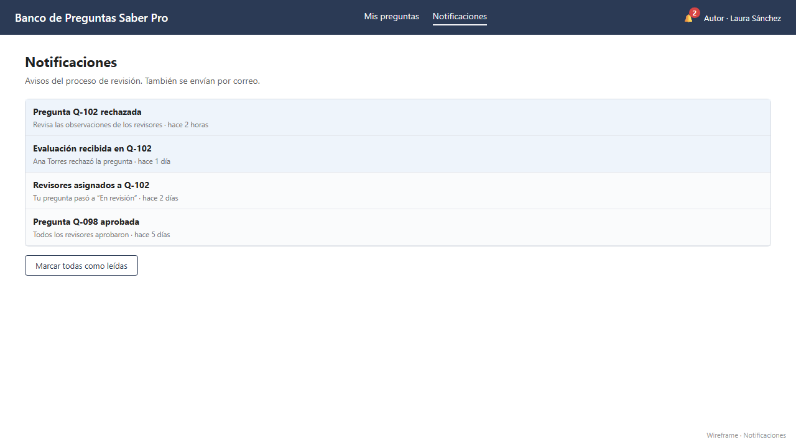

# 06 · Prototipos

Como el frontend pasa a ser una aplicación web separada, los prototipos del segundo corte son
wireframes de pantallas web. Cubren lo nuevo de la iteración: el ajuste de HU-04, la nueva HU-05 y las
notificaciones. Las pantallas de HU-01 a HU-03 del primer corte se rediseñarán en la tecnología web que se
elija; su estructura (formulario, listado con filtros y paginación, estados con color) se conserva.

Los prototipos están en Figma, en la página **Corte 2 - Prototipos web (HU-04 y HU-05)** del archivo
[Taller 4 - Mockup Banco de Preguntas](https://www.figma.com/design/kk6g0a8B4gv7wqCsYRb4Xd/Taller-4---Mockup-Banco-de-Preguntas?node-id=157-2),
el mismo que conserva los prototipos del primer corte en su propia página.

También se guarda la fuente HTML en [`prototipos/wireframes.html`](prototipos/wireframes.html); cada pantalla
se abre con su ancla, por ejemplo `wireframes.html#s4`.

| Pantalla | Historia | Imagen |
|---|---|---|
| Inicio de sesión | Seguridad mínima | [proto-1](img/proto-1-login.png) |
| Asignar de 1 a 3 revisores | HU-04 | [proto-2](img/proto-2-hu04-asignar-revisores.png) |
| Bandeja del revisor | HU-05 | [proto-3](img/proto-3-hu05-bandeja-revisor.png) |
| Evaluar una pregunta | HU-05 | [proto-4](img/proto-4-hu05-evaluacion.png) |
| El autor lee las observaciones | HU-05 | [proto-5](img/proto-5-hu05-autor-observaciones.png) |
| Notificaciones | HU-04 y HU-05 | [proto-6](img/proto-6-notificaciones.png) |

## Inicio de sesión

## HU-04 · Asignar revisores

El administrador elige una pregunta pendiente y marca de 1 a 3 revisores. El autor no aparece en la lista.
Al intentar un cuarto revisor se muestra el error y no se guarda.

## HU-05 · Bandeja del revisor

## HU-05 · Evaluar una pregunta

El revisor lee la pregunta completa, decide aprobar o rechazar y escribe observaciones, obligatorias si
rechaza. A la derecha ve las observaciones de los demás revisores.

## HU-05 · El autor lee las observaciones

## Notificaciones

## Validación de usabilidad

Pendiente: aplicar el método *thinking aloud* con las pantallas nuevas una vez estén implementadas.
